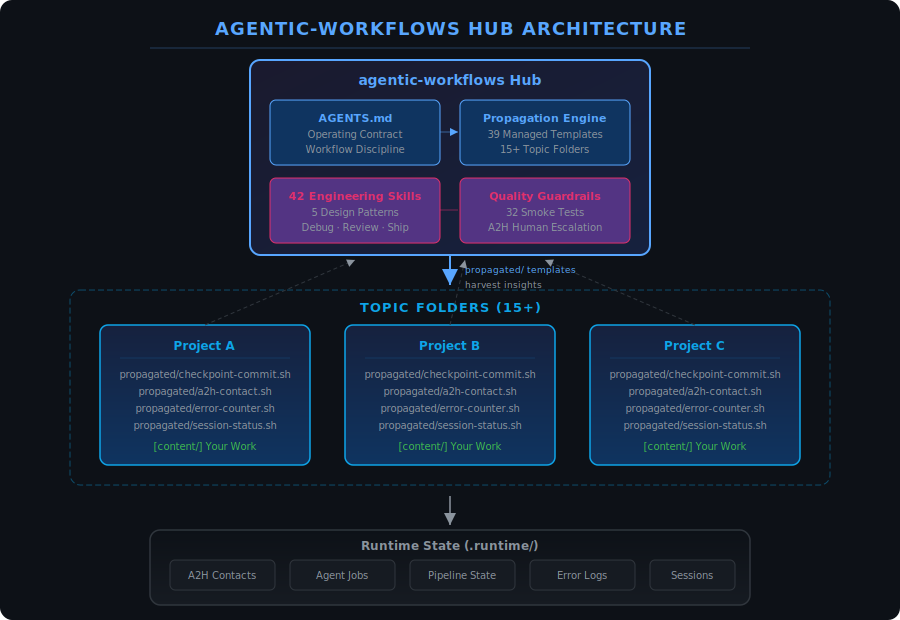

<p align="center">
  <picture>
    <source media="(prefers-color-scheme: dark)" srcset="https://img.shields.io/badge/agentic--workflows-ffffff?style=for-the-badge&logo=github&logoColor=white&labelColor=181717">
    
  </picture>
</p>

<p align="center">
  <a href="#quick-start">Quick Start</a>&ensp;·&ensp;
  <a href="#features">Features</a>&ensp;·&ensp;
  <a href="#how-it-works">How It Works</a>&ensp;·&ensp;
  <a href="#orientation">Orientation</a>&ensp;·&ensp;
  <a href="#ecosystem">Ecosystem</a>
</p>

<p align="center">
  <a href="https://github.com/B67687/agentic-workflows/blob/main/LICENSE"></a>
  <a href="https://github.com/B67687/agentic-workflows"></a>
  <a href="https://github.com/B67687/agentic-workflows"></a>
  <a href="https://github.com/B67687/agentic-workflows"></a>
  <a href="https://github.com/B67687/agentic-workflows/issues"></a>
  <a href="https://github.com/B67687/agentic-workflows/pulls"></a>
  <a href="https://github.com/B67687/agentic-workflows/graphs/commit-activity"></a>
  <a href="https://github.com/B67687/agentic-workflows/commits/main"></a>
</p>

<br>

<p align="center">
  
</p>

<p align="center">
  <a href="docs/hub-architecture.svg">
    
  </a>
  <br>
  <sub>SVG architecture diagram --- <a href="docs/hub-architecture.svg">view full size</a></sub>
</p>

<p align="center">
  
  
  
  
</p>

<p align="center">
  <b>Works with</b>&ensp;
  
  
  
  
  
  
</p>

---

<h2 id="quick-start">🚀 Quick Start</h2>

<table>
<tr>
  <td width="33%" align="center">
    <h3>1</h3>
    <br>
    <code>git clone https://github.com/B67687/agentic-workflows.git</code><br>
    <sub>Get the hub</sub>
  </td>
  <td width="33%" align="center">
    <h3>2</h3>
    <br>
    <code>bash ./scripts/test-smoke.sh</code><br>
    <sub>32 tests confirm everything works</sub>
  </td>
  <td width="33%" align="center">
    <h3>3</h3>
    <br>
    <a href="AGENTS.md"><code>AGENTS.md</code></a><br>
    <sub>That's the operating contract --- every agent reads it first</sub>
  </td>
</tr>
</table>

<p align="center">
  <b>Then run</b> <code>bash ./scripts/propagate.sh all --apply</code> <b>to push templates to your own repos, or add a <code>CLAUDE.md</code> pointing here for single-project use.</b>
</p>

---

<h2 id="features">🧩 Features</h2>

<table>
<tr>
  <td width="33%" valign="top">
    <br>
    <strong>🧠 Operating Contract</strong><br>
    Shared rules, conventions, and escalation paths that every agent reads on entry. No more ad-hoc sessions.
  </td>
  <td width="33%" valign="top">
    <br>
    <strong>📚 Skill System</strong><br>
    42 production-grade engineering skills with companion scripts. Debug, test, review, ship, deprecate, document.
  </td>
  <td width="33%" valign="top">
    <br>
    <strong>🔄 Knowledge Propagation</strong><br>
    Change once in the hub, templates flow to 15+ topic folders automatically. Centralized management, decentralized work.
  </td>
</tr>
<tr>
  <td width="33%" valign="top">
    <br>
    <strong>💾 Persistent Memory</strong><br>
    agentmemory MCP captures tool use, compresses observations, injects context across sessions. Pick up where you left off.
  </td>
  <td width="33%" valign="top">
    <br>
    <strong>⚡ Workflow Discipline</strong><br>
    Checkpoints, handoffs, session management, pipeline dispatch, context-aware worktrees. Structured phases, not chaotic chats.
  </td>
  <td width="33%" valign="top">
    <br>
    <strong>🔬 Research Engine</strong><br>
    6-phase systematic research: frame > discover > gather > triangulate > apply > preserve. Source confidence weighting.
  </td>
</tr>
<tr>
  <td width="33%" valign="top">
    <br>
    <strong>🛡️ Quality Guardrails</strong><br>
    Assumption expiry, context pressure monitoring, debug triage, pre-push quality gates, error counters with human escalation.
  </td>
  <td width="33%" valign="top">
    <br>
    <strong>🌐 Multi-Repo Orchestration</strong><br>
    One hub, 15+ topic folders. Propagate templates, harvest insights. Cross-project memory loop keeps knowledge flowing.
  </td>
  <td width="33%" valign="top">
    <br>
    <strong>🧪 Test-Driven Agents</strong><br>
    Red/green TDD patterns, verification targets, 32-test smoke suite. Every change verified before it's committed.
  </td>
</tr>
</table>

---

<h2 id="how-it-works">⚙️ How It Works</h2>

<table>
<tr>
  <td width="33%" align="center">
    <h2>📥</h2>
    <h3>1. Define</h3>
    <p><code>AGENTS.md</code> sets the rules. Every agent reads it on entry. Skills, commands, and propagation templates inherit from it.</p>
  </td>
  <td width="33%" align="center">
    <h2>🔄</h2>
    <h3>2. Propagate</h3>
    <p><code>propagate.sh</code> pushes templates to topic folders. One change in the hub updates 15+ repos. Commands, scripts, configs --- all synced.</p>
  </td>
  <td width="33%" align="center">
    <h2>📤</h2>
    <h3>3. Harvest</h3>
    <p>Learnings flow back to the hub via insight harvesting. Cross-project memory loops keep knowledge circulating instead of siloed.</p>
  </td>
</tr>
</table>

---

<h2 id="orientation">🗺️ Orientation</h2>

<table>
<tr>
  <td width="50%" valign="top">

```
agentic-workflows/
├── AGENTS.md      -> Operating contract
├── commands/      -> /task, /plan, /research...
├── docs/          -> Quickstart, quality, workflow
├── scripts/       -> 83 automation scripts
├── skills/        -> 42 engineering skills
├── propagation/   -> Templates for topic folders
├── research/      -> Active campaigns
├── .runtime/      -> Generated state (A2H, jobs, logs)
└── wiki/          -> Knowledge graph output
```

  </td>
  <td width="50%" valign="top">

| Quick Command | Action |
|:---|---:|
| <code>bash ./scripts/session-status.sh</code> | Workspace health |
| <code>bash ./scripts/tools.sh</code> | Tool registry |
| <code>bash ./scripts/search-index.sh "q"</code> | BM25 search |
| <code>bash ./scripts/propagate.sh status</code> | Sync status |
| <code>bash ./scripts/checkpoint-commit.sh -m "msg"</code> | Verified commit |

<br>

| Need | Go to |
|:---|---:|
| Understand the system | [docs/workflow.md](docs/workflow.md) |
| Set up your project | [docs/hub-quickstart.md](docs/hub-quickstart.md) |
| Research a topic | [research/research-prompt.md](research/research-prompt.md) |
| Debug a failure | [debugging skill](skills/debugging-and-error-recovery/SKILL.md) |
| Code review | [review skill](skills/code-review-and-quality/SKILL.md) |
| Resume work | [session-state.json](session-state.json) |

  </td>
</tr>
</table>

---

<h2 id="ecosystem">🌍 Ecosystem</h2>

<p>This harness was built by studying and integrating patterns from <b>50+ open-source projects</b> across the agent ecosystem.</p>

<table>
<tr>
  <td width="33%" valign="top">
    <br>
    AutoGen · Google ADK · Claude Agent SDK · OpenAI Agents SDK · Pydantic AI · AutoGPT · MetaGPT · A2A Protocol · Hermes Agent · AgentScope · Open-SWE · crewAI
  </td>
  <td width="33%" valign="top">
    <br>
    Claude Code · Aider · HumanLayer · GStack · UI-TARS · Deer Flow · browser-use · OpenCode · Pi
  </td>
  <td width="33%" valign="top">
    <br>
    Agent-Skills · 12-Factor Agents · System Design Primer · tree-sitter · promptfoo
  </td>
</tr>
</table>

<details>
<summary><b>Full ecosystem</b> --- 50+ projects across 8 more categories</summary>

| Category | Projects |
|----------|----------|
|  | Mem0, LMCache, MemPalace, MemOS, PageIndex, agentmemory, GraphRAG, RAG-Anything |
|  | n8n, Flowise, Langflow, Dify, Manifest, Infisical |
|  | Pi-Skills, Karpathy-Skills, Codex Skills, Counsel, Everything Claude Code, Awesome Claude Code, awesome-codex-skills |
|  | MCP Registry, MCP Servers, GitHub MCP Server |
|  | Cline, CUA, Rufo, Agency-Agents, Codex CLI, generative-ai-for-beginners |
|  | readme-svg-wave-divider-generator, readme-hub, GitHub Readme Stats, readme-aura |
|  | DeepSeek-V3, OpenAI Codex, Qwen, Gemini CLI, Hello Agents, Claude Code Best Practice |

</details>

<details>
<summary><b>Tools used in this project</b></summary>

| Tool | Use |
|------|-----|
| [tree-sitter](https://github.com/tree-sitter/tree-sitter) | Repo-map generation |
| [Playwright](https://github.com/microsoft/playwright) | Browser automation |
| [RTK](https://github.com/ericseppanen/rtk) | File counting & analysis |
| [git-filter-repo](https://github.com/newren/git-filter-repo) | Git history management |
| [promptfoo](https://github.com/promptfoo/promptfoo) | Prompt evaluation |

</details>

<br>
<sub>If you maintain a project listed here and would prefer different attribution or removal, please <a href="https://github.com/B67687/agentic-workflows/issues">open an issue</a>.</sub>

---

<p align="center">
  <sub>
    <a href="https://github.com/B67687/agentic-workflows/blob/main/LICENSE">MIT License</a>
    ·
    <a href="https://github.com/B67687/agentic-workflows/issues">Issues</a>
    ·
    <a href="https://github.com/B67687/agentic-workflows/discussions">Discussions</a>
  </sub>
  <br>
  <sub>Built with patterns from the open-source agent community.</sub>
</p>
