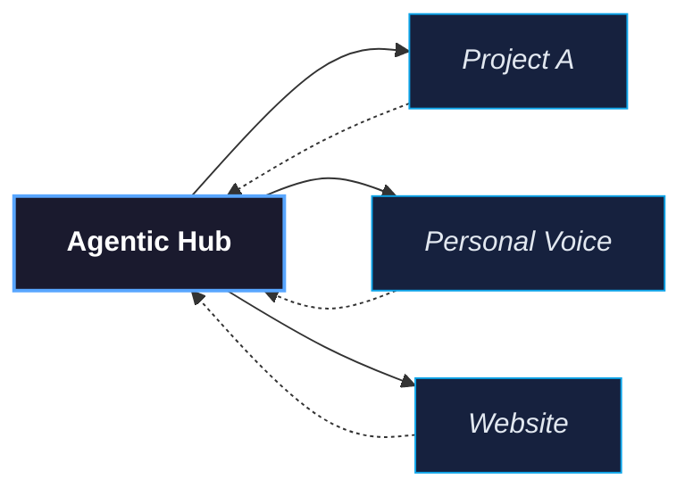

<p align="center">
  <picture>
    <source media="(prefers-color-scheme: dark)" srcset="https://img.shields.io/badge/agentic--workflows-ffffff?style=for-the-badge&logo=github&logoColor=white&labelColor=181717">
    
  </picture>
</p>

<p align="center">
  <a href="#quick-start">Quick Start</a>&ensp;·&ensp;
  <a href="#features">Features</a>&ensp;·&ensp;
  <a href="#how-it-works">How It Works</a>&ensp;·&ensp;
  <a href="#orientation">Orientation</a>&ensp;·&ensp;
  <a href="#ecosystem">Ecosystem</a>
</p>

<p align="center">
  <a href="https://github.com/B67687/agentic-workflows/blob/main/LICENSE"></a>
  <a href="https://github.com/B67687/agentic-workflows"></a>
  <a href="https://github.com/B67687/agentic-workflows"></a>
  <a href="https://github.com/B67687/agentic-workflows"></a>
  <a href="https://github.com/B67687/agentic-workflows/issues"></a>
  <a href="https://github.com/B67687/agentic-workflows/pulls"></a>
</p>

<p align="center">
  <a href="https://github.com/B67687/agentic-workflows"></a>
</p>

<br>

<p align="center">
  
</p>



<p align="center">
  
  
  
  
</p>

<p align="center">
  <b>Works with</b>&ensp;
  
  
  
  
  
  
</p>

---


<h2 id="quick-start">Quick Start</h2>

```bash
git clone https://github.com/B67687/agentic-workflows.git
cd agentic-workflows
bash ./scripts/test-smoke.sh           # 32 tests --- verify everything works
bash ./scripts/session-status.sh       # Workspace orientation
```

**Then open [`AGENTS.md`](AGENTS.md)** --- that's the operating contract. Every agent reads it first. Add a `CLAUDE.md` to your project pointing here, or run `bash ./scripts/propagate.sh all --apply` to propagate templates to your own repos.

---


<h2 id="features">Features</h2>

<table>
<tr>
  <td width="33%" valign="top">
    <h4>🧠 Operating Contract</h4>
    <p><a href="AGENTS.md"><code>AGENTS.md</code></a> --- shared rules, conventions, and escalation paths that every agent reads on entry. No more ad-hoc sessions.</p>
  </td>
  <td width="33%" valign="top">
    <h4>📚 Skill System</h4>
    <p><a href="skills/"><code>skills/</code></a> --- 41 production-grade engineering skills with companion scripts. Debug, test, review, ship, deprecate, document.</p>
  </td>
  <td width="33%" valign="top">
    <h4>🔄 Knowledge Propagation</h4>
    <p><a href="propagation/"><code>propagation/</code></a> --- change once in the hub, templates flow to 25+ topic folders automatically.</p>
  </td>
</tr>
<tr>
  <td width="33%" valign="top">
    <h4>💾 Persistent Memory</h4>
    <p>Agentmemory captures tool use, compresses observations, injects context across sessions via agentmemory MCP.</p>
  </td>
  <td width="33%" valign="top">
    <h4>⚡ Workflow Discipline</h4>
    <p>Checkpoints, handoffs, session management, pipeline dispatch, context-aware worktrees. Structured phases instead of chaotic chats.</p>
  </td>
  <td width="33%" valign="top">
    <h4>🔬 Research Engine</h4>
    <p>6-phase systematic research: frame -> discover -> gather -> triangulate -> apply -> preserve. Source confidence weighting.</p>
  </td>
</tr>
<tr>
  <td width="33%" valign="top">
    <h4>🛡️ Quality Guardrails</h4>
    <p>Assumption expiry, context pressure monitoring, debug triage, pre-push quality gates, error counters with human escalation (A2H).</p>
  </td>
  <td width="33%" valign="top">
    <h4>🌐 Multi-Repo Orchestration</h4>
    <p>One hub, 15+ topic folders. Propagate templates, harvest insights. Cross-project memory loop keeps knowledge flowing both ways.</p>
  </td>
  <td width="33%" valign="top">
    <h4>🧪 Test-Driven Agents</h4>
    <p>Red/green TDD patterns, verification targets, 32-test smoke suite. Every change verified before it's committed.</p>
  </td>
</tr>
</table>

---


<h2 id="how-it-works">How It Works</h2>

<table>
<tr>
  <td width="50%" valign="top">

### For a single project

```bash
# 1. Copy the operating contract
cp -r propagation/* my-project/

# 2. Read it on session start
cat AGENTS.md

# 3. Agents carry shared context into your repo
```

  </td>
  <td width="50%" valign="top">

### For multiple projects (the hub model)

```bash
# 1. This repo becomes the hub
# 2. Templates flow to every topic folder
bash ./scripts/propagate.sh all --apply

# 3. Pull learnings back
bash ./scripts/harvest-topic-insights.sh
```

  </td>
</tr>
</table>

---


<h2 id="orientation">One-Minute Orientation</h2>

```
agentic-workflows/
├── AGENTS.md            <- Read this first --- the operating contract
├── commands/            <- Slash commands (/task, /plan, /research...)
├── docs/                <- Core documentation (quickstart, quality, etc.)
├── scripts/             <- 83 automation scripts + hooks
├── skills/              <- 42 engineering skills (debug, review, ship...)
├── propagation/         <- Templates synced across topic folders
├── research/            <- Active research campaigns
├── swarmvault.schema.md <- Knowledge graph schema
└── wiki/                <- SwarmVault knowledge graph output
```

<table>
<tr>
  <td width="50%" valign="top">

### Common Commands

| Command | What it does |
|---------|-------------|
| `bash ./scripts/session-status.sh` | Workspace orientation |
| `bash ./scripts/tools.sh` | Tool registry |
| `bash ./scripts/search-index.sh "q"` | BM25 search |
| `bash ./scripts/propagate.sh status` | Sync status |
| `bash ./scripts/checkpoint-commit.sh -m "msg"` | Safe verified commit |

  </td>
  <td width="50%" valign="top">

### Documentation Compass

| I Want To... | Start Here |
|---|---|
| Understand the whole system | [docs/workflow.md](docs/workflow.md) |
| Set this up in my project | [docs/hub-quickstart.md](docs/hub-quickstart.md) |
| Research an AI topic | [research/research-prompt.md](research/research-prompt.md) |
| Debug a failure | [skills/debugging-and-error-recovery/SKILL.md](skills/debugging-and-error-recovery/SKILL.md) |
| Review code quality | [skills/code-review-and-quality/SKILL.md](skills/code-review-and-quality/SKILL.md) |
| Resume interrupted work | [session-state.json](session-state.json) + [AGENTS.md](AGENTS.md) |

  </td>
</tr>
</table>

---


<h2 id="ecosystem">Ecosystem</h2>

<p>This harness was built by studying and integrating patterns from <b>50+ open-source projects</b> across agent frameworks, developer tools, skills methodology, memory systems, workflow platforms, and LLM infrastructure.</p>

<h3>Core Inspirations</h3>

<table>
<tr>
  <td width="33%" valign="top">
    <h4>🤖 Agent Frameworks</h4>
    <ul>
      <li><a href="https://github.com/microsoft/autogen">AutoGen</a> --- Multi-agent convos</li>
      <li><a href="https://github.com/google/adk-python">Google ADK</a> --- 5 skill design patterns</li>
      <li><a href="https://github.com/anthropics/claude-agent-sdk">Claude Agent SDK</a> --- Lifecycle & tool use</li>
      <li><a href="https://github.com/openai/openai-agents-python">OpenAI Agents SDK</a> --- Handoff patterns</li>
      <li><a href="https://github.com/Significant-Gravitas/AutoGPT">AutoGPT</a> --- Autonomous loops</li>
    </ul>
  </td>
  <td width="33%" valign="top">
    <h4>🛠️ Developer Tools</h4>
    <ul>
      <li><a href="https://github.com/anthropics/claude-code">Claude Code</a> --- Agentic coding</li>
      <li><a href="https://github.com/Aider-AI/aider">Aider</a> --- Pair programming agent</li>
      <li><a href="https://github.com/humanlayer/humanlayer">HumanLayer</a> --- A2H protocol</li>
      <li><a href="https://github.com/garrytan/gstack">GStack</a> --- Git workflow</li>
      <li><a href="https://github.com/anomaloco/opencode">OpenCode</a> --- The runtime</li>
    </ul>
  </td>
  <td width="33%" valign="top">
    <h4>📘 Methodology</h4>
    <ul>
      <li><a href="https://github.com/addyosmani/agent-skills">Agent-Skills</a> --- 27 engineering skills</li>
      <li><a href="https://github.com/humanlayer/12-factor-agents">12-Factor Agents</a> --- F1-F12 principles</li>
      <li><a href="https://github.com/ruvnet/ruflo">Ruflo</a> --- Task routing</li>
      <li><a href="https://github.com/jiangjiax/counsel">Counsel</a> --- Debate methodology</li>
      <li><a href="https://github.com/VoltAgent/awesome-design-md">Design MD</a> --- Visual language</li>
    </ul>
  </td>
</tr>
</table>

<details>
<summary><b>Full ecosystem</b> --- 50+ projects across 8 categories</summary>

| Category | Key Projects |
|----------|-------------|
| **Agent Frameworks** | AutoGen, crewAI, OpenAI Agents SDK, Google ADK, Claude Agent SDK, Pydantic AI, AutoGPT, MetaGPT, A2A Protocol, Hermes Agent, AgentScope, Open-SWE |
| **CLIs & Dev Tools** | Claude Code, Aider, GStack, HumanLayer, UI-TARS, Deer Flow, browser-use |
| **Skills & Quality** | Agent-Skills, 12-Factor Agents, System Design Primer, tree-sitter, promptfoo |
| **Memory & RAG** | Mem0, LMCache, MemPalace, MemOS, PageIndex, agentmemory, GraphRAG |
| **Workflow Platforms** | n8n, Flowise, Langflow, Dify, Manifest, Infisical |
| **Prompt Libraries** | Pi-Skills, Karpathy-Skills, Codex Skills, Counsel, Awe(Claude Code) |
| **README Design & Rendering** | [readme-svg-typing-generator](https://github.com/readme-SVG/readme-SVG-typing-generator), [readme-svg-wave-divider-generator](https://github.com/readme-SVG/readme-SVG-wave-divider-generator), [GitHub Readme Stats](https://github.com/anuraghazra/github-readme-stats), [readme-hub](https://github.com/mkr-infinity/readme-hub) |
| **MCP & Protocols** | MCP Registry, MCP Servers, GitHub MCP Server |
| **Agent Platforms** | Pi, Cline, CUA, Rufo, Agency-Agents, OpenCode |
| **LLMs & Learning** | DeepSeek-V3, OpenAI Codex, Qwen, Gemini CLI, Hello Agents, Claude Code Best Practice, Generative AI for Beginners |

</details>

<details>
<summary><b>Tools used in this project</b></summary>

| Tool | Use |
|------|-----|
| [tree-sitter](https://github.com/tree-sitter/tree-sitter) | Repo-map generation |
| [Playwright](https://github.com/microsoft/playwright) | Browser automation |
| [RTK (Rust Token Killer)](https://github.com/ericseppanen/rtk) | File counting & analysis |
| [git-filter-repo](https://github.com/newren/git-filter-repo) | Git history management |
| [promptfoo](https://github.com/promptfoo/promptfoo) | Prompt evaluation |
| [readme-aura](https://github.com/collectioneur/readme-aura) | React/JSX to SVG README components |
| [SVG Typing Generator](https://github.com/readme-SVG/readme-SVG-typing-generator) | Animated README header |
| [GitHub Readme Stats](https://github.com/anuraghazra/github-readme-stats) | Repository stats |
| [Wave Divider Generator](https://github.com/readme-SVG/readme-SVG-wave-divider-generator) | Section dividers |

</details>

<br>

*If you maintain a project listed here and would prefer different attribution or removal, please [open an issue](https://github.com/B67687/agentic-workflows/issues).*

---

<p align="center">
  
</p>

<p align="center">
  <sub>
    <a href="https://github.com/B67687/agentic-workflows/blob/main/LICENSE">MIT License</a>
    ·
    <a href="https://github.com/B67687/agentic-workflows/issues">Issues</a>
    ·
    <a href="https://github.com/B67687/agentic-workflows/discussions">Discussions</a>
  </sub>
  <br>
  <sub>Built with patterns from the open-source agent community.</sub>
</p>
