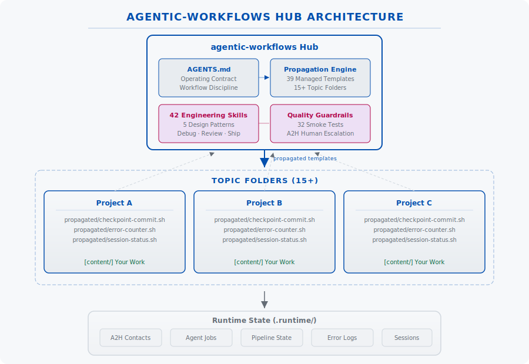
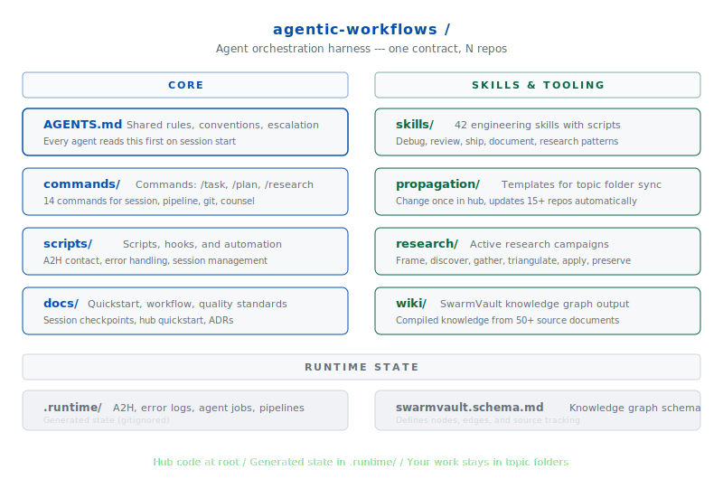

<p align="center">
  <picture>
    <source media="(prefers-color-scheme: dark)" srcset="https://img.shields.io/badge/agentic--workflows-ffffff?style=for-the-badge&logo=github&logoColor=white&labelColor=181717">
    
  </picture>
</p>

<p align="center">
  <a href="#quick-start">Quick Start</a>&ensp;·&ensp;
  <a href="#features">Features</a>&ensp;·&ensp;
  <a href="#how-it-works">How It Works</a>&ensp;·&ensp;
  <a href="#orientation">Orientation</a>&ensp;·&ensp;
  <a href="#ecosystem">Ecosystem</a>
</p>

<p align="center">
  <a href="https://github.com/B67687/agentic-workflows/blob/main/LICENSE"></a>
  <a href="https://github.com/B67687/agentic-workflows"></a>
  <a href="https://github.com/B67687/agentic-workflows"></a>
  <a href="https://github.com/B67687/agentic-workflows"></a>
  <a href="https://github.com/B67687/agentic-workflows/issues"></a>
  <a href="https://github.com/B67687/agentic-workflows/pulls"></a>
  <a href="https://github.com/B67687/agentic-workflows/graphs/commit-activity"></a>
  <a href="https://github.com/B67687/agentic-workflows/commits/main"></a>
  <br><br>
  
</p>

<p align="center">
  <a href="docs/hub-architecture.svg">
    <picture>
      <source media="(prefers-color-scheme: dark)" srcset="docs/hub-architecture.svg">
      
    </picture>
  </a>
</p>

<p align="center">
  
  
  
  
</p>

<p align="center">
  <b>Works with</b>&ensp;
  
  
  
  
  
  
</p>

<h2 id="quick-start">Quick Start</h2>

```bash
git clone https://github.com/B67687/agentic-workflows.git
cd agentic-workflows
```

Open **[`AGENTS.md`](AGENTS.md)** -- that's the operating contract. Every agent reads it first. Then verify everything works:

```bash
bash ./scripts/test-smoke.sh
bash ./scripts/propagate.sh all --apply    # push templates to your repos
```


<h2 id="how-it-works">How It Works</h2>

<h3>Define</h3>
<a href="AGENTS.md"><code>AGENTS.md</code></a> sets the operating contract. Every agent reads it on entry. Skills, commands, and propagation templates inherit from this single source of truth.

<h3>Propagate</h3>
<a href="scripts/propagate.sh"><code>propagate.sh</code></a> pushes templates to topic folders. One change in the hub updates 15+ repos. Commands, scripts, and configs all synced.

<h3>Harvest</h3>
Learnings flow back to the hub via insight harvesting. Cross-project memory loops keep knowledge circulating instead of siloed in individual projects.


<h2 id="features">Features</h2>

<div align="center">

| | |
|---|---|
| **AGENTS.md** | Shared rules and conventions every agent reads on entry |
| **42 engineering skills** | Debug, review, ship, document patterns. Companion scripts for each |
| **Template propagation** | Change once in the hub, sync to 15+ repos automatically |
| **agentmemory MCP** | Captures tool use, compresses observations across sessions |
| **Workflow discipline** | Checkpoints, handoffs, pipelines instead of chaotic chats |
| **6-phase research** | Frame, discover, triangulate, apply, preserve methodology |
| **Quality guardrails** | A2H escalation, assumption expiry, pre-push gates, error counters |
| **Cross-project loop** | Propagate templates, harvest insights across all repos |
| **32-test smoke suite** | Every change verified before commit. TDD patterns included |

</div>


<h2 id="orientation">Orientation</h2>

<p align="center">
  <picture>
    <source media="(prefers-color-scheme: dark)" srcset="docs/folder-structure.svg">
    
  </picture>
</p>

<h3 id="commands">Common Commands</h3>

```bash
bash ./scripts/session-status.sh        # Workspace health
bash ./scripts/tools.sh                 # Tool registry
bash ./scripts/search-index.sh "query"  # BM25 search
bash ./scripts/propagate.sh status      # Sync status
bash ./scripts/checkpoint-commit.sh -m "msg"  # Verified commit
```

See [docs/workflow.md](docs/workflow.md) for the full system, [docs/hub-quickstart.md](docs/hub-quickstart.md) to set up your own project, or open [session-state.json](session-state.json) to resume interrupted work.


<h2 id="ecosystem">Ecosystem</h2>

<p>This harness was built by studying and integrating patterns from <b>50+ open-source projects</b> across the agent ecosystem. Projects with <code>*</code> have patterns extracted into skills, scripts, or documentation.</p>

<h3>Core Inspirations</h3>

<div align="center">

<table>
<tr>
  <td width="33%" valign="top">
    <br>
    AutoGen · <a href="https://github.com/google/adk-python"><b>*Google ADK</b></a> · Claude Agent SDK · OpenAI Agents SDK · Pydantic AI · AutoGPT · MetaGPT · A2A Protocol · Hermes Agent · AgentScope · Open-SWE · <a href="https://github.com/crewAIInc/crewAI"><b>*crewAI</b></a>
  </td>
  <td width="33%" valign="top">
    <br>
    <a href="https://code.claude.com/docs/en/best-practices"><b>*Claude Code</b></a> · <a href="https://github.com/Aider-AI/aider"><b>*Aider</b></a> · <a href="https://github.com/humanlayer/humanlayer"><b>*HumanLayer</b></a> · <a href="https://github.com/garrytan/gstack"><b>*GStack</b></a> · UI-TARS · Deer Flow · <a href="https://github.com/browser-use/browser-use"><b>*browser-use</b></a> · <a href="https://github.com/anomalyco/opencode"><b>*OpenCode</b></a> · Pi
  </td>
  <td width="33%" valign="top">
    <br>
    <a href="https://github.com/addyosmani/agent-skills"><b>*Agent-Skills</b></a> · <a href="https://github.com/humanlayer/12-factor-agents"><b>*12-Factor Agents</b></a> · System Design Primer · <a href="https://github.com/tree-sitter/tree-sitter"><b>*tree-sitter</b></a> · promptfoo
  </td>
</tr>
</table>

</div>

<h3>Full Ecosystem</h3>

<details open>
<summary>50+ projects across 8 more categories</summary>

<div align="center">

| Category | Projects |
|----------|----------|
|  | Mem0, LMCache, MemPalace, MemOS, PageIndex,<br><a href="https://github.com/zilliztech/claude-context"><b>*agentmemory</b></a>, GraphRAG, RAG-Anything |
|  | n8n, Flowise, Langflow, Dify, Manifest, Infisical |
|  | Pi-Skills, <a href="https://github.com/karpathy/autoresearch"><b>*Karpathy-Skills</b></a>, Codex Skills, <b>*Counsel</b>,<br>Everything Claude Code, Awesome Claude Code, awesome-codex-skills |
|  | MCP Registry, MCP Servers, GitHub MCP Server |
|  | Cline, CUA, <b>*Rufo (ruflo)</b>, Agency-Agents,<br>Codex CLI, generative-ai-for-beginners |
|  | readme-svg-wave-divider-generator, readme-hub,<br>GitHub Readme Stats, <a href="https://github.com/VoltAgent/awesome-design-md"><b>*awesome-design-md</b></a> |
|  | DeepSeek-V3, OpenAI Codex, Qwen, Gemini CLI,<br>Hello Agents, Claude Code Best Practice |

</div>

</details>

<h3>Tools Used</h3>

<details open>
<summary>Software that helped build this project</summary>

<div align="center">

| Tool | Use |
|------|-----|
| [tree-sitter](https://github.com/tree-sitter/tree-sitter) | Repo-map generation |
| [*Playwright](https://github.com/microsoft/playwright) | Browser automation (POM) |
| [RTK](https://github.com/ericseppanen/rtk) | File counting & analysis |
| [git-filter-repo](https://github.com/newren/git-filter-repo) | Git history management |
| [promptfoo](https://github.com/promptfoo/promptfoo) | Prompt evaluation |

</div>

</details>

<br>
<p align="center"><sub>Ready to start? Read <a href="#quick-start">Quick Start</a> or open <a href="AGENTS.md">AGENTS.md</a> to begin.</sub></p>

<p align="center"><sub>&ensp;&middot;&ensp;&middot;&ensp;&middot;&ensp;</sub></p>
<p align="center"><sub>If you maintain a project listed here and would prefer different attribution or removal, please <a href="https://github.com/B67687/agentic-workflows/issues">open an issue</a>.</sub></p>

<p align="center">
  <sub>
    <a href="https://github.com/B67687/agentic-workflows/blob/main/LICENSE">MIT License</a>
    ·
    <a href="https://github.com/B67687/agentic-workflows/issues">Issues</a>
  </sub>
  <br>
  <sub>Built with &hearts; from the open-source agent community.</sub>
</p>
