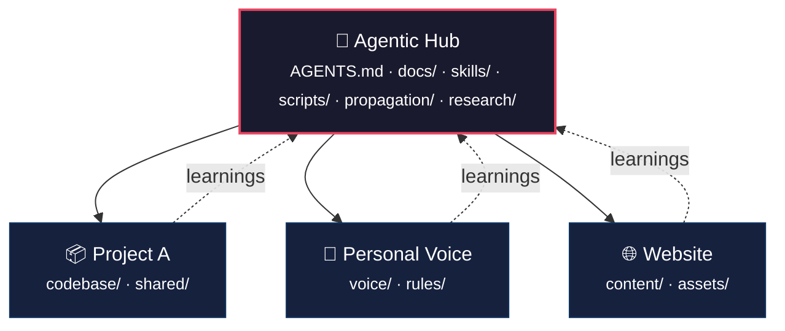

<p align="center">
  <picture>
    <source media="(prefers-color-scheme: dark)" srcset="https://img.shields.io/badge/agentic–workflows-ffffff?style=for-the-badge&logo=github&logoColor=white&labelColor=181717">
    
  </picture>
</p>

<p align="center">
  <b>Systems engineering for AI agents.</b><br>
  An operating contract, workflow discipline, and knowledge propagation harness<br>
  for orchestrating AI agents across any number of repositories.
</p>

<p align="center">
  <a href="https://github.com/B67687/agentic-workflows/blob/main/LICENSE"></a>
  <a href="https://github.com/B67687/agentic-workflows"></a>
  <a href="https://github.com/B67687/agentic-workflows"></a>
  <a href="https://github.com/B67687/agentic-workflows"></a>
  
</p>

<br>



*One hub. One contract. N repos. Shared knowledge flows both ways.*

<br>

## Quick Start

```bash
git clone https://github.com/B67687/agentic-workflows.git
cd agentic-workflows
bash ./scripts/test-smoke.sh           # Verify everything works
bash ./scripts/session-status.sh       # Workspace orientation
```

**Then open [`AGENTS.md`](AGENTS.md)** — that's the operating contract. Every agent reads it first. Add a `CLAUDE.md` to your project pointing here, or fork the model to propagate templates to your own repos.

---

## Features

<table>
<tr>
  <td width="33%" valign="top">
    <h4>🧠 Operating Contract</h4>
    <p><a href="AGENTS.md"><code>AGENTS.md</code></a> — shared rules, conventions, and escalation paths that every agent reads on entry. No more ad-hoc sessions.</p>
  </td>
  <td width="33%" valign="top">
    <h4>📚 Skill System</h4>
    <p><a href="skills/"><code>skills/</code></a> — 41 production-grade engineering skills with companion scripts. Debug, test, review, ship, deprecate, document.</p>
  </td>
  <td width="33%" valign="top">
    <h4>🔄 Knowledge Propagation</h4>
    <p><a href="propagation/"><code>propagation/</code></a> — change once in the hub, templates flow to every topic folder automatically.</p>
  </td>
</tr>
<tr>
  <td width="33%" valign="top">
    <h4>💾 Persistent Memory</h4>
    <p>Agentmemory captures tool use, compresses observations, injects context. Agents pick up where they left off, across sessions.</p>
  </td>
  <td width="33%" valign="top">
    <h4>⚡ Workflow Discipline</h4>
    <p>Checkpoints, handoffs, session management, pipeline dispatch. Structured phases instead of chaotic chats.</p>
  </td>
  <td width="33%" valign="top">
    <h4>🔬 Research Engine</h4>
    <p>6-phase systematic research: frame → discover → gather → triangulate → apply → preserve. Source confidence, authority weighting.</p>
  </td>
</tr>
<tr>
  <td width="33%" valign="top">
    <h4>🛡️ Quality Guardrails</h4>
    <p>Assumption expiry, context pressure monitoring, debug triage, pre-push hooks, error counters with human escalation.</p>
  </td>
  <td width="33%" valign="top">
    <h4>🌐 Multi-Repo Orchestration</h4>
    <p>One hub, 25+ topic folders. Propagate templates, harvest insights. Cross-project memory loop keeps knowledge flowing.</p>
  </td>
  <td width="33%" valign="top">
    <h4>🧪 Test-Driven Agents</h4>
    <p>Red/green TDD patterns, verification targets, smoke tests. Every change is verified before it's committed.</p>
  </td>
</tr>
</table>

---

## How It Works

### For a single project

```
1. Copy AGENTS.md into your repo root
2. Pick relevant skills from skills/
3. Add docs/workflow.md for session management
4. Agents now carry shared context when they enter your repo
```

### For multiple projects (the hub model)

```
1. This repo becomes the hub
2. Run  bash ./scripts/propagate-to-all.sh --apply
3. Shared templates flow to every topic folder
4. Run  bash ./scripts/harvest-topic-insights.sh  to pull learnings back
```

**Compatible with:** Claude Code, Codex CLI, Cursor, OpenCode, and any agentic IDE that reads `AGENTS.md` or `CLAUDE.md`.

---

## One-Minute Orientation

```
agentic-workflows/
├── AGENTS.md            ← Read this first — the operating contract
├── commands/            ← Slash commands (/task, /plan, /research...)
├── docs/                ← Core documentation (quickstart, quality, etc.)
├── scripts/             ← Automation, tooling, hooks
├── skills/              ← 41 engineering skills (debug, review, ship...)
├── propagation/         ← Templates synced across topic folders
├── research/            ← Active research campaigns
├── swarmvault.schema.md ← Knowledge graph schema
└── wiki/                ← SwarmVault knowledge graph output
```

### Common Commands

| Command | What it does |
|---------|-------------|
| `bash ./scripts/session-status.sh` | Workspace orientation |
| `bash ./scripts/ws.sh status` | Check workspace state |
| `bash ./scripts/ws.sh validate` | Quality audit |
| `bash ./scripts/tools.sh` | Tool registry |
| `bash ./scripts/search-index.sh "query"` | BM25 search across all docs |
| `bash ./scripts/checkpoint-commit.sh -m "msg"` | Safe verified commit |

### Documentation Compass

| I Want To... | Start Here |
|---|---|
| Understand the whole system | [docs/workflow.md](docs/workflow.md) |
| Set this up in my project | [docs/hub-quickstart.md](docs/hub-quickstart.md) |
| Write better prompts | [docs/daily-prompts.md](docs/daily-prompts.md) |
| Research an AI topic | [research/research-prompt.md](research/research-prompt.md) |
| Build an AI product | [docs/ai-product-building.md](docs/ai-product-building.md) |
| Debug a failure | [skills/debugging-and-error-recovery/SKILL.md](skills/debugging-and-error-recovery/SKILL.md) |
| Review code quality | [skills/code-review-and-quality/SKILL.md](skills/code-review-and-quality/SKILL.md) |
| Resume interrupted work | [session-state.json](session-state.json) + [AGENTS.md](AGENTS.md) |

---

## Ecosystem

This harness was built by studying and integrating patterns from the following open-source projects.

<details>
<summary><b>Agent Frameworks & SDKs</b> (12 projects)</summary>

| Repo | Influence |
|------|-----------|
| [microsoft/autogen](https://github.com/microsoft/autogen) | Multi-agent conversation patterns |
| [crewAIInc/crewAI](https://github.com/crewAIInc/crewAI) | Role-based agent orchestration |
| [openai/openai-agents-python](https://github.com/openai/openai-agents-python) | Agent loop and handoff design |
| [google/adk-python](https://github.com/google/adk-python) | Agent Development Kit patterns |
| [anthropics/claude-agent-sdk](https://github.com/anthropics/claude-agent-sdk) | Agent lifecycle and tool use |
| [pydantic/pydantic-ai](https://github.com/pydantic/pydantic-ai) | Type-safe agent definitions |
| [Significant-Gravitas/AutoGPT](https://github.com/Significant-Gravitas/AutoGPT) | Autonomous agent loop concepts |
| [1024lab/MetaGPT](https://github.com/1024lab/MetaGPT) | Role-based software team simulation |
| [a2aproject/A2A](https://github.com/a2aproject/A2A) | Agent-to-agent protocol |
| [nousresearch/hermes-agent](https://github.com/nousresearch/hermes-agent) | Research agent architecture |
| [agentscope-ai/agentscope](https://github.com/agentscope-ai/agentscope) | Distributed agent platform |
| [langchain-ai/Open-SWE](https://github.com/langchain-ai/Open-SWE) | Software engineering agent patterns |
</details>

<details>
<summary><b>Agent CLIs & Developer Tools</b> (9 projects)</summary>

| Repo | Influence |
|------|-----------|
| [anthropics/claude-code](https://github.com/anthropics/claude-code) | Agentic coding workflow patterns |
| [anthropics/claude-plugins-official](https://github.com/anthropics/claude-plugins-official) | Plugin/skill integration patterns |
| [Aider-AI/aider](https://github.com/Aider-AI/aider) | Pair-programming agent patterns |
| [SWE-agent/mini-SWE-agent](https://github.com/SWE-agent/mini-SWE-agent) | Lightweight agent architecture |
| [garrytan/gstack](https://github.com/garrytan/gstack) | Git workflow and stack management |
| [humanlayer/humanlayer](https://github.com/humanlayer/humanlayer) | CodeLayer IDE + human-in-the-loop SDK |
| [browser-use/browser-use](https://github.com/browser-use/browser-use) | Browser automation patterns |
| [bytedance/UI-TARS-desktop](https://github.com/bytedance/UI-TARS-desktop) | UI agent interaction patterns |
| [bytedance/deer-flow](https://github.com/bytedance/deer-flow) | Workflow-based agent coordination |
</details>

<details>
<summary><b>Skills, Quality & Methodology</b> (5 projects)</summary>

| Repo | Influence |
|------|-----------|
| [addyosmani/agent-skills](https://github.com/addyosmani/agent-skills) | **Core skill framework** — 27 engineering + 14 TAP methodology skills |
| [humanlayer/12-factor-agents](https://github.com/humanlayer/12-factor-agents) | 12-factor principles for reliable LLM apps |
| [donnemartin/system-design-primer](https://github.com/donnemartin/system-design-primer) | Systems engineering methodology |
| [tree-sitter/tree-sitter](https://github.com/tree-sitter/tree-sitter) | Repo-map generation |
| [promptfoo/promptfoo](https://github.com/promptfoo/promptfoo) | Prompt testing patterns |
</details>

<details>
<summary><b>Memory, Knowledge & RAG</b> (8 projects)</summary>

| Repo | Influence |
|------|-----------|
| [mem0ai/mem0](https://github.com/mem0ai/mem0) | Memory layer patterns |
| [LMCache/LMCache](https://github.com/LMCache/LMCache) | LLM context caching |
| [MemPalace/mempalace](https://github.com/MemPalace/mempalace) | Memory palace architecture |
| [MemTensor/MemOS](https://github.com/MemTensor/MemOS) | Memory OS concepts |
| [VectifyAI/PageIndex](https://github.com/VectifyAI/PageIndex) | Knowledge indexing patterns |
| [HKUDS/RAG-Anything](https://github.com/HKUDS/RAG-Anything) | RAG pipeline patterns |
| [rohitg00/agentmemory](https://github.com/rohitg00/agentmemory) | Persistent agent memory |
| [microsoft/graphrag](https://github.com/microsoft/graphrag) | Graph-based RAG |
</details>

<details>
<summary><b>Workflow & Automation Platforms</b> (6 projects)</summary>

| Repo | Influence |
|------|-----------|
| [n8n-io/n8n](https://github.com/n8n-io/n8n) | Workflow automation patterns |
| [FlowiseAI/Flowise](https://github.com/FlowiseAI/Flowise) | Visual workflow builder concepts |
| [langflow-ai/langflow](https://github.com/langflow-ai/langflow) | LangChain-based workflow patterns |
| [langgenius/dify](https://github.com/langgenius/dify) | LLM application platform patterns |
| [mnfst/manifest](https://github.com/mnfst/manifest) | Backend-as-code workflow concepts |
| [Infisical/infisical](https://github.com/Infisical/infisical) | Secrets management patterns |
</details>

<details>
<summary><b>Agent Skills & Prompt Libraries</b> (7 projects)</summary>

| Repo | Influence |
|------|-----------|
| [badlogic/pi-skills](https://github.com/badlogic/pi-skills) | Agent skill patterns |
| [forrestchang/andrej-karpathy-skills](https://github.com/forrestchang/andrej-karpathy-skills) | Developer skill methodology |
| [mattpocock/skills](https://github.com/mattpocock/skills) | TypeScript skill patterns |
| [ComposioHQ/awesome-codex-skills](https://github.com/ComposioHQ/awesome-codex-skills) | Codex skill collection |
| [jiangjiax/counsel](https://github.com/jiangjiax/counsel) | AI counsel / debate methodology |
| [affaan-m/everything-claude-code](https://github.com/affaan-m/everything-claude-code) | Claude Code resource collection |
| [hesreallyhim/awesome-claude-code](https://github.com/hesreallyhim/awesome-claude-code) | Claude Code tooling collection |
</details>

<details>
<summary><b>MCP & Protocols</b> (3 projects)</summary>

| Repo | Influence |
|------|-----------|
| [modelcontextprotocol/registry](https://github.com/modelcontextprotocol/registry) | MCP tool patterns |
| [modelcontextprotocol/servers](https://github.com/modelcontextprotocol/servers) | MCP server implementations |
| [github/github-mcp-server](https://github.com/github/github-mcp-server) | GitHub MCP integration |
</details>

<details>
<summary><b>Agent Platforms & Infrastructure</b> (6 projects)</summary>

| Repo | Influence |
|------|-----------|
| [earendil-works/pi](https://github.com/earendil-works/pi) | Agent platform patterns |
| [cline/cline](https://github.com/cline/cline) | Autonomous coding agent |
| [trycua/cua](https://github.com/trycua/cua) | Computer use agent |
| [ruvnet/ruflo](https://github.com/ruvnet/ruflo) | Agent orchestration |
| [msitarzewski/agency-agents](https://github.com/msitarzewski/agency-agents) | Agency framework |
| [anomaloco/opencode](https://github.com/anomaloco/opencode) | The runtime this harness runs on |
</details>

<details>
<summary><b>LLMs, UI & Learning</b> (10+ projects)</summary>

| Category | Repos |
|----------|-------|
| **LLMs** | [deepseek-ai/DeepSeek-V3](https://github.com/deepseek-ai/DeepSeek-V3), [openai/codex](https://github.com/openai/codex), [QwenLM/Qwen](https://github.com/QwenLM/Qwen), [QwenLM/qwen-code](https://github.com/QwenLM/qwen-code), [google-gemini/gemini-cli](https://github.com/google-gemini/gemini-cli) |
| **UI & Design** | [VoltAgent/awesome-design-md](https://github.com/VoltAgent/awesome-design-md), [charmbracelet/crush](https://github.com/charmbracelet/crush), [karpathy/autoresearch](https://github.com/karpathy/autoresearch), [karpathy/llm-council](https://github.com/karpathy/llm-council) |
| **Learning** | [datawhalechina/hello-agents](https://github.com/datawhalechina/hello-agents), [jjyaoao/HelloAgents](https://github.com/jjyaoao/HelloAgents), [shanraisshan/claude-code-best-practice](https://github.com/shanraisshan/claude-code-best-practice), [microsoft/generative-ai-for-beginners](https://github.com/microsoft/generative-ai-for-beginners) |
| **Tools Used** | [tree-sitter/tree-sitter](https://github.com/tree-sitter/tree-sitter), [microsoft/playwright](https://github.com/microsoft/playwright), [newren/git-filter-repo](https://github.com/newren/git-filter-repo), [promptfoo/promptfoo](https://github.com/promptfoo/promptfoo), [volcengine/OpenViking](https://github.com/volcengine/OpenViking) |
</details>

If you maintain a project listed here and would prefer different attribution or removal, please [open an issue](https://github.com/B67687/agentic-workflows/issues).

---

<p align="center">
  <sub>
    <a href="https://github.com/B67687/agentic-workflows/blob/main/LICENSE">MIT License</a>
    ·
    <a href="https://github.com/B67687/agentic-workflows/blob/main/CONTRIBUTING.md">Contributing</a>
    ·
    <a href="https://github.com/B67687/agentic-workflows/issues">Issues</a>
  </sub>
</p>
