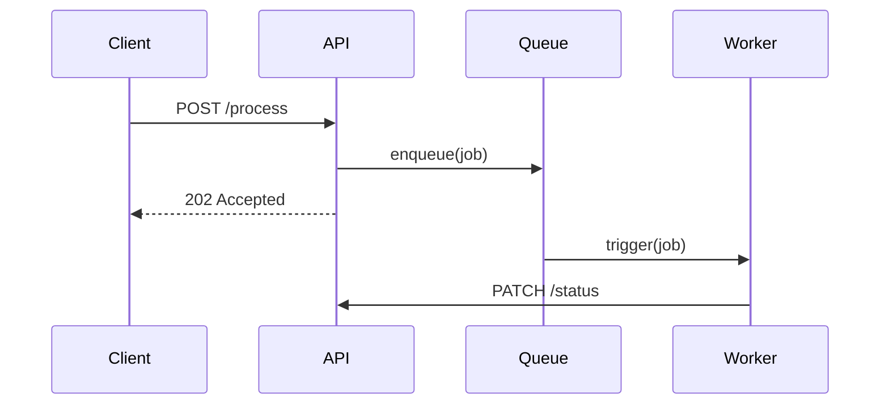

# AI Product Building with Agents

How to build products fast using AI agents — grounded in this workspace's best practices and validated patterns from 2026.

## Executive Summary

**What this is:** A playbook for building AI-first products in 3 days to 8 weeks using agentic workflows.
**Who should read:** Anyone building a product, feature, or MVP with AI assistance.
**Key takeaways:**
- Modern MVPs are **learning machines** with instrumentation and monetization from day one
- A **one-page spec (300-500 words)** constrains the AI and speeds delivery
- Use **agent specialization** (research, scaffold, build, refactor) like a small team
- Timeline: simple feature (3-5 days), standard SaaS (1-2 weeks), full product (6-8 weeks)

**Read the full doc below, or jump to a section:**
- [AI-First MVP Definition](#ai-first-mvp-definition)
- [Timeline Benchmarks](#timeline-benchmarks)
- [One-Page Spec Method](#one-page-spec-method)
- [Agent Setup Patterns](#agent-setup-patterns)
- [Build Sequence](#build-sequence)

## AI-First MVP Definition

A modern MVP is not a thin feature slice. It's a **learning machine** built around your core user action.

What makes it different from traditional MVP:

- **Instrumentation from day one** — events, funnels, session replays
- **Basic monetization included** — Stripe, waitlist with intent signals, or manual invoice
- **Hosted and stable** — users can actually reach it
- **One clearly defined action** — not a kitchen sink

The goal: Learn whether people will pay before building more.

## Timeline Benchmarks

| Complexity | Timeline | Typical Cost |
|------------|----------|--------------|
| Simple (single feature) | 3-5 days | $50-150 |
| Standard SaaS | 1-2 weeks | $100-400 |
| Full product | 6-8 weeks | $500-2000 |

**What affects timeline most**: How clearly you defined the core feature before starting. A tight one-page spec gets you to launch faster than a vague idea with 20 features.

**Reference**: AstroMVP reports 3-day builds (adworthy.ai), Idea to MVP reports 6-week cycles.

## One-Page Spec Method

Skip the 40-page PRD. Your AI agent doesn't need it — and neither do you.

**Template (300-500 words)**:

```
## Who is this for
[Target user — be specific: "freelance designers" not "people"]

## What problem do they have
[One sentence on the pain point]

## What the app does about it
[How it solves the problem — one feature at a core]

## How it makes money
[Revenue model: subscription, one-time, etc.]
```

**Why it works**: The spec exists to constrain the AI agent so it doesn't build features you don't need yet.

**Example**: Finix (expense tracker) spec was 387 words. Tradezo (crypto app) was ~500 words.

## Agent Setup Patterns

Based on workspace best practice: **"Choose The Lightest Execution Lane"**

Treat AI agents like a small product team, not autocomplete:

| Agent | Role | When to Use |
|-------|------|-------------|
| **Research** | Scan docs, competitors, edge cases | Discovery phase |
| **Scaffolding** | Spin up boilerplate, auth, DB | Week 2 |
| **Build** | Implement core feature | Week 3 |
| **Refactor + Test** | Keep code clean | After each major change |

**Your role**: PM + tech lead. Write crisp prompts that look like tickets: clear outcome, constraints, examples, definition of done.

**Workspace integration**: Use "Give Rich Evidence" — provide concrete logs, examples, configs to agents instead of vague instructions.

## Build Sequence

Based on Idea to MVP's 6-week loop and AstroMVP's 5-step process:

1. **Week 1**: Problem deep-dive, research, sharp spec
2. **Week 2**: Scaffolding (backend, UI shell, auth)
3. **Week 3**: Core feature — the one thing that makes your product different
4. **Week 4**: Instrumentation, analytics, dashboard
5. **Week 5**: Private beta with 5-10 target users
6. **Week 6**: Polish, pricing, launch

**Key principle**: Build the core feature FIRST. Not the landing page, not the settings panel, not auth. The thing that makes your product different.

**Workspace integration**: Use "Supply Missing Structure When Safe" — if the user hasn't defined verification criteria, add them proactively.

## 5-User Validation Threshold

Don't ship to 500 users. Ship to 5 first.

- If you can't convince 5 people to use it, the problem isn't your tech stack
- Get real feedback before scaling
- This is your validation gate before expanding

**Workspace integration**: Aligns with "Define Done And Verification Early" — set the 5-user goal as explicit success criteria.

## Guardrails

The dark side of "vibe coding": unmaintainable code, no tests, no clear domain model.

**Non-negotiable constraints**:

- **Simple architecture** — one diagram is enough, document it
- **Refactor after major changes** — use agents to add tests, not just generate code
- **Basic design system** — lock it in so UI doesn't fragment
- **Regular narration check** — ask agents to explain files in plain language; if it's hard to narrate, it's too complex

**Workspace integration**: 
- "Optimize For Quality, Not Output Volume" — generated code is cheap, good code is not
- "Promote Repeated Work" — skill files and reusable prompts prevent reinvention

## Reliability Thresholds

Based on Makebolt's framework — set BEFORE building, not after.

**Workspace best practice integration**: This is "Define Done And Verification Early" applied to product building.

**What to define**:

| Threshold | Example |
|-----------|---------|
| Minimum completion quality | 80% of requests complete successfully |
| Maximum escalation rate | <10% require human fallback |
| Zero-tolerance failures | No unauthorized actions, no fabricated data |
| Target cycle time | Response within X seconds |

**Write scope statements** with: trigger, context, action, fallback.

Example: "When a support ticket arrives with account metadata, classify severity, draft a response based on policy, and route medium/high-risk items to human queue."

## Phased Launch

Don't ship to everyone on day one.

**Phases**:

1. **Internal users first** — test with team, catch failures
2. **Narrow production cohort** — 10-50 users who match your target
3. **Expand by workflow segment** — only after first lane is stable

**Why it matters**: Expansion before stability multiplies failure modes and creates support load that buries the team. A smaller reliable lane generates better learning than broad unstable coverage.

## Weekly Iteration Rhythm

Based on Makebolt's 90-day cadence — aligned with workspace "Plan When Ambiguity Is High"

| Day | Focus |
|-----|-------|
| **Monday** | Deploy to next cohort or new segment |
| **Wednesday** | Measure: success rate, cost, escalation trends |
| **Friday** | Fix top 3 failures or kill underperforming features |

**Accountability**: Keep one owner for this loop. Shared ownership without clear accountability leads to noisy data.

## Cost Benchmarks

| Item | Typical Cost |
|------|---------------|
| AI agent API usage | $40-150 |
| Infrastructure (Vercel, Supabase) | Free tiers |
| Domain | $12 |
| Skill files / prompts | $0-100 |
| **Total MVP** | **$100-400** |

**vs Traditional**: $15k-40k for dev shop, 8-12 week wait time.

## Integration with Workspace Best Practices

This document applies the workspace's core principles to product building:

| Workspace Principle | Application |
|---------------------|-------------|
| **Scope Tightly** | One-page spec constrains what agents build |
| **Give Rich Evidence** | Provide concrete context, not "build a SaaS app" |
| **Supply Missing Structure** | Add verification targets when user hasn't |
| **Define Done Early** | Set reliability thresholds before building |
| **Choose Lightest Lane** | Match agent type to task (research vs build vs refactor) |
| **Optimize Quality** | Refactor + test agent after each major change |
| **Promote Repeated Work** | Skill files, reusable prompts for common patterns |
| **Verify Aggressively** | 5-user validation before scaling |
| **Plan And Re-Plan** | Weekly iteration rhythm, adjust based on data |

## Quick Reference

### One-Page Spec Template

```
## Who is this for
[Specific target user]

## What problem do they have
[One sentence]

## What the app does about it
[One core feature]

## How it makes money
[Revenue model]
```

### Agent Prompt Template

```
Build [specific feature] for [target user] using [tech stack].

Requirements:
- Must have: [list]
- Must avoid: [list]

Done when:
- [success criteria]
- [verification method]
```

### Launch Gate Checklist

- [ ] One-page spec written (<500 words)
- [ ] Core feature defined (not feature list)
- [ ] Reliability thresholds set (before coding)
- [ ] Zero-tolerance failures defined
- [ ] Fallback/escalation path designed
- [ ] 5-user validation target set
- [ ] Architecture diagram (one page)
- [ ] Design system locked (basic)
- [ ] Weekly review owner assigned

## 2026 Research: Trending Tools

Based on research from April 2026, these tools are worth considering for product building:

### Visual/No-Code Builders
| Tool | Stars | Use Case |
|------|-------|----------|
| [Langflow](https://github.com/langflow-ai/langflow) | 147k | Visual drag-and-drop AI workflow builder, MCP server/client, multi-agent orchestration, API deployment |
| [Dify](https://github.com/langgenius/dify) | 138k | Production-ready agent platform, MCP-native |
| [n8n](https://github.com/n8n-io/n8n) | 184k | Workflow automation, MCP-native |
| [Flowise](https://github.com/FlowiseAI/Flowise) | 51k | Low-code LLM apps |

### Agent Frameworks
| Tool | Stars | Use Case |
|------|-------|----------|
| [AutoGPT](https://github.com/Significant-Gravitas/AutoGPT) | 183k | Pioneer autonomous agent |
| [MetaGPT](https://github.com/1024lab/MetaGPT) | 66k | Multi-agent simulating software company |
| [CrewAI](https://github.com/crewAIInc/crewAI) | 48k | Role-playing autonomous agent teams |
| [AutoGen](https://github.com/microsoft/autogen) | 56k | Microsoft multi-agent conversation |
| [VoltAgent](https://github.com/voltagent/voltagent) | 8k | TypeScript framework with memory, RAG, MCP |
| [Google ADK Python](https://github.com/google/adk-python) | 19k | Google's official Python agent toolkit |
| [Pydantic-AI](https://github.com/pydantic/pydantic-ai) | 16.4k | Type-safe agent dev with Pydantic validation |

### TypeScript Agent Framework (Deep Dive: VoltAgent)

Based on research (7,993+ stars), VoltAgent is "the Next.js of AI agents" — TypeScript-first, batteries included:

**Core Features**:
- **Type-safe tools** — Zod for parameter validation
- **Persistent memory** — LibSQL/SQLite adapters, cross-conversation context
- **Multi-agent orchestration** — Supervisor pattern for agent teams
- **Workflow engine** — Multi-step automation with pause/resume
- **RAG integration** — Pinecone, Postgres, Supabase vector stores
- **Guardrails** — Runtime input/output validation
- **Voice support** — TTS and STT capabilities
- **MCP integration** — Connect to any MCP server as tool source
- **VoltOps Console** — Built-in observability (tracing, debugging, monitoring)

**Why TypeScript Matters**: Python dominates AI tooling, but VoltAgent brings TypeScript best practices (type safety, IntelliSense, testing patterns) to agent development.

**Use Cases**:
- Production AI agents requiring observability
- Teams with existing TypeScript/React expertise
- Multi-agent systems needing supervisor coordination

### Coding Agents
| Tool | Stars | Use Case |
|------|-------|----------|
| [OpenClaw](https://github.com/openclaw/pen) | 348k | #1 GitHub repo, local-first privacy |
| [Claude Agent SDK](https://github.com/anthropics/claude-agent-sdk) | 15k | Anthropic's SDK for coding agents |
| [Browser-use](https://github.com/browser-use/browser-use) | 86k | Website automation for agents |

### Decision Framework for Tool Selection

| Need | Recommended |
|------|-------------|
| Visual/no-code workflows | Langflow, Dify, n8n |
| Multi-agent collaboration | MetaGPT, CrewAI, AutoGen, Deer-Flow |
| Coding agent | Claude Agent SDK, OpenClaw |
| TypeScript stack | VoltAgent, Pydantic-AI |
| Browser automation | Browser-use |
| Self-improving agents | Hermes Agent |
| Memory systems | MemPalace, MemOS, OpenViking |
| Google ecosystem | Google ADK Python |

### Multi-Agent Harnesses

Based on research (April 2026):

**[Deer-Flow](https://github.com/bytedance/deer-flow)** (62k stars) — ByteDance's long-horizon agent harness:
- Sandboxes, memories, tools, skills, subagents
- Designed for complex multi-agent research/coding tasks
- Long-horizon task execution with built-in review loops

**[AgentScope](https://github.com/agentscope-ai/agentscope)** (23.9k stars) — Multi-agent platform with visual debugging:
- "Agents you can see, understand and trust"
- Visual debugging for multi-agent systems
- Focus on transparency addresses production pain points

**Why harnesses matter**: A harness is to agents what a framework is to libraries — it provides the execution environment, memory, tools, and coordination. Choose based on: debugging needs, scaling requirements, and integration points.

### Memory Systems for Agents

Memory is becoming a first-class concern in agent frameworks:

**[MemPalace](https://github.com/MemPalace/mempalace)** (47k stars) — Best-benchmarked open-source memory:
- Explicit benchmarking focus for memory evaluation
- Addresses the gap: how do you evaluate if memory is working?

**[MemOS](https://github.com/MemTensor/MemOS)** (8.4k stars) — AI memory OS:
- Persistent skill memory across tasks
- Cross-task skill reuse and evolution
- Memory operating system concept

**[OpenViking](https://github.com/volcengine/OpenViking)** (22.4k stars) — Context database:
- Filesystem paradigm for context/memory/skills/resources
- Could simplify agent architecture by modeling memory as files

**Key insight**: Memory systems are maturing — expect benchmark-driven comparison like we have for models.

### Multi-Agent Memory Sharing (April 2026)

**Memory Sharing Patterns:**

| Pattern | Description | Use Case |
|---------|-------------|----------|
| **Shared user_id** | Multiple agents share memory via same user_id | Collaborative tasks |
| **Memory Transfer** | One agent passes context to another via handover | Sequential handoffs |
| **Mediator Orchestration** | Central handler routes memory between agents | Complex pipelines |

**Key Systems:**
- **Mem0 v3** (53k stars): Multi-level (User/Session/Agent), 91.6 LoCoMo, 72% lower token usage vs full context
- **MemOS** (8.4k): Memory OS with MemCube, cross-task skill reuse, graph + vector retrieval

**Best Practices:**
- Hierarchical retrieval: User → Session → Agent memory
- Token-efficient: Mem0 uses 7K avg vs 25K+ for full context
- Isolation + sharing balance: Per-agent memory isolation, skill sharing on demand

### Coding Agents (Beyond OpenClaw)

**[crush](https://github.com/charmbracelet/crush)** (23.1k stars) — TUI-first "glamorous agentic coding":
- Aesthetic focus for coding agents (TUI, not GUI)
- Different UX paradigm than Cursor/OpenCode
- From the Charm team (known for quality CLI tools)

**[awesome-claude-code](https://github.com/hesreallyhim/awesome-claude-code)** (39.1k stars) — Claude Code ecosystem hub:
- Curated list of skills, hooks, slash-commands
- Central hub for Claude Code extensibility
- Growing rapidly as Claude Code adoption increases

### New Paradigm: Vectorless RAG

**[PageIndex](https://github.com/VectifyAI/PageIndex)** (25.4k stars) — Vectorless, reasoning-based RAG:
- Challenges vector embedding orthodoxy
- Uses reasoning instead of embeddings for retrieval
- Represents a fundamental shift in how RAG might work

**Why it matters**: Vector embeddings dominate current RAG implementations. If reasoning-based retrieval proves superior, this could reshape how agents access knowledge.

**Watch this space**: This is early (25k stars) but represents a paradigm challenge worth monitoring.

### Self-Improving Agents

Based on [Hermes Agent](https://github.com/nousresearch/hermes-agent) (85k+ stars) — the only open-source agent with a built-in learning loop:

**What Makes It Different**:
- Creates skills from experience during use
- Improves skills during use (self-evolution)
- Nudges itself to persist knowledge
- Searches its own past conversations (FTS5 session search)
- Builds a deepening model of who you are across sessions

**Key Capabilities**:
- Supports 400+ models via Nous Portal, OpenRouter, Ollama, vLLM
- Pluggable memory providers (v0.7.0 Resilience Release)
- Credential rotation, Camofox anti-detection
- Self-evolution ecosystem using DSPy + GEPA

**Why It Matters**: The agents that win in 2026 won't be the ones with the most tools — they'll be the ones that improve themselves. Hermes Agent represents this shift.

### Local-First Privacy Agents

Based on [OpenClaw](https://github.com/openclaw/openclaw) (349k stars) — became #1 GitHub repo, surpassing React:

**Core Philosophy**: "Your own personal AI assistant. Any OS. Any Platform."

**Key Features**:
- **Local-first Gateway** — single control plane for sessions, channels, tools
- **Multi-channel inbox** — WhatsApp, Telegram, Slack, Discord, Google Chat, Signal
- **Multi-agent routing** — route to isolated agents (workspaces + sandboxes)
- **Model Router** — unified BYOK interface (OpenAI, Anthropic, Google, DeepSeek)
- **Docker sandboxes** — for non-main sessions

**Privacy & Data Sovereignty**:
- Every conversation stays on your infrastructure
- No data flows to cloud servers (except optional anonymous metrics)
- Complete auditability — review every line before deployment
- 73% of enterprises rank data sovereignty as top-3 requirement (Gartner 2026)

**Cost Comparison**:
| Method | Monthly Cost |
|--------|-------------|
| Local Hardware | $2-10 (API only) |
| VPS (Hetzner/DO) | $6-16 |
| Self-Hosted (Railway) | $7-17 |
| OneClaw Managed | $12-20 |
| vs ChatGPT Plus | $20 (less functionality) |

### Virtual Engineering Team Pattern

Based on [gstack](https://github.com/garrytan/gstack) (72.7k stars) — Garry Tan's (YC President) setup for shipping 600K+ lines in 60 days:

**The Core Insight**: Transform a single AI agent into a virtual team with specialized roles.

| Skill | Role | What They Do |
|-------|------|-------------|
| `/office-hours` | YC Office Hours | 6 forcing questions that reframe your product before code |
| `/plan-ceo-review` | CEO/Founder | Rethink the problem, find 10-star product hiding in request |
| `/plan-eng-review` | Eng Manager | Lock architecture, data flow, edge cases, tests |
| `/plan-design-review` | Senior Designer | Rate each design dimension 0-10, AI slop detection |
| `/review` | Staff Engineer | Find bugs that pass CI but blow up in production |
| `/qa` | QA Lead | Test your app, find bugs, fix with atomic commits |
| `/ship` | Release Engineer | Sync main, run tests, push, open PR |
| `/retro` | Eng Manager | Team-aware weekly retro, per-person breakdowns |

**Sprint Workflow**: Think → Plan → Build → Review → Test → Ship → Reflect

Each skill feeds into the next: office-hours writes design doc that plan-ceo-review reads.

### Complete Agent Harness Systems

Based on [everything-claude-code](https://github.com/affaan-m/everything-claude-code) (156k stars):

**What's Inside**:
- 38 specialized subagents (planner, architect, code-reviewer, security-reviewer, etc.)
- 156+ skills across 12 language ecosystems (TypeScript, Python, Go, Java, C++, Rust, etc.)
- Cross-harness support: Claude Code, Codex, Cursor, OpenCode, Gemini

**Key Capabilities**:
- Token optimization (model selection, prompt slimming, background processes)
- Memory persistence (hooks that save/load context across sessions)
- Continuous learning (auto-extract patterns into reusable skills)
- Security scanning (AgentShield integration)

## Agent Architecture Patterns

Based on [Refactoring.Guru](https://refactoring.guru/) design patterns — directly applicable to AI agent architecture:

### Behavioral Patterns

| Pattern | Agent Application |
|---------|------------------|
| **Strategy** | Swappable AI models, tool selection logic, prompt engineering approaches |
| **Command** | Action queuing, undo/redo capabilities, task scheduling in agent workflows |
| **Observer** | Event-driven agent systems, callback handling, state change notifications |
| **State** | Managing complex conversation states and context transitions |
| **Mediator** | Orchestrating multiple agents, managing inter-agent communication |

### Structural Patterns

| Pattern | Agent Application |
|---------|------------------|
| **Adapter** | Wrapping different LLM APIs into unified interface |
| **Builder** | Constructing complex prompts, agent configurations, tool chains |
| **Facade** | Simplified interfaces to complex agent subsystems |
| **Proxy** | Rate limiting, caching, access control for agent tools |

### SOLID Principles for Agents

| Principle | Agent Application |
|-----------|------------------|
| **Single Responsibility** | Each agent skill does one thing well |
| **Open-Closed** | Extend agent capabilities without modifying core |
| **Liskov Substitution** | Swap LLM providers without breaking tools |
| **Interface Segregation** | Tools expose only what agents need |
| **Dependency Inversion** | Depend on abstractions, not concrete LLM implementations |

### System Design for Agents

Based on [System Design Primer](https://github.com/donnemartin/system-design-primer) (342k stars):

- **Scalability**: Scale agent systems horizontally (more agents) and vertically (bigger models)
- **CAP Trade-offs**: Consistency vs availability in distributed agent deployments
- **Database Selection**: Choose appropriate storage for agent state, memory, context
- **Caching Strategies**: Manage context windows and conversation history efficiently
- **API Design**: Build robust interfaces for agent tool calling

### Integration: Which Tool for What

| Scenario | Best Tool | Why |
|----------|-----------|-----|
| Build a full product from scratch | gstack | End-to-end sprint with 23 specialized skills |
| Optimize existing agent workflow | everything-claude-code | Cross-harness, comprehensive optimization |
| Multi-agent collaboration | MetaGPT | Simulates entire software company |
| Visual/no-code workflows | Langflow, Dify | Drag-and-drop AI builders |
| Single coding agent | OpenClaw, Claude Code | Privacy-first, local execution |

## Sources

- [Idea to MVP (2026)](https://ideatomvp.ai/blog/idea-to-mvp-with-ai-agents-2026-playbook) — 6-week loop, agent team patterns
- [AstroMVP](https://www.astromvp.com/blog/build-mvp-with-ai-agent) — 3-10 day builds, $110 cost
- [Makebolt](https://makebolt.com/blog/ai-agent-mvp-2026-what-to-build-first) — reliability thresholds, phased launch
- [GTA-2 Benchmark (arXiv:2604.15715)](https://arxiv.org/abs/2604.15715) — Hierarchical benchmark for General Tool Agents
- [MemEvoBench (arXiv:2604.15774)](https://arxiv.org/abs/2604.15774) — Memory misevolution under adversarial conditions

---

## Agent Reliability Research (2026)

### The Smart vs Functional Agent Gap

Research reveals a clear differentiator between smart and functional agents:

| Characteristic | Smart Agent | Functional Agent |
|---------------|-------------|------------------|
| **Verification** | Self-verifies outputs before reporting | Executes without checking |
| **Memory** | Dynamic validation, adapts | Static prompts, no adaptation |
| **Planning** | Plans before execution, replans when degraded | Executes directly |
| **Error handling** | Catches and recovers from errors | Fails and stops |
| **Quality** | Test before output | Output first, test later |

### GTA-2 Benchmark Findings

The GTA-2 benchmark (arXiv:2604.15715) tests General Tool Agents across:
- Atomic tasks (simple tool use)
- Compositional tasks (tool chains)
- Open-ended workflows (complex real-world)

**Results**: Frontier models achieve:
- ~50% on atomic tasks
- ~25% on compositional tasks  
- **14.39% on open workflows**

**Implication**: Model quality alone is insufficient. Execution harness design — how agents plan, verify, and recover — matters more than raw capability.

### Memory Contamination Risk

MemEvoBench (arXiv:2604.15774) demonstrates:
- Static prompt defenses are insufficient
- Memory contamination from adversarial injection, noisy outputs, biased feedback causes substantial safety degradation
- Dynamic memory validation required

**Practical implication**: Don't trust memory implicitly. Validate before acting on stored knowledge.

### MCP v2 Beta

New MCP features enabling multi-agent coordination:
- OAuth 2.0 support
- Transport evolution
- Tasks primitive for inter-agent communication

---

## Agentic Workflows Best Practices (April 2026)

### Sequential vs Parallel Execution

| Mode | When to Use | Example |
|------|-------------|---------|
| **Sequential** | Tasks have dependencies | Research → Write → Review |
| **Parallel** | Independent tasks | Analyze 5 files simultaneously |

### Supervisor-Worker Patterns

**Hierarchical Process** (CrewAI):
- Supervisor plans, delegates, reviews
- Workers execute assigned tasks
- Use GPT-4 class for supervisor, cheaper for workers

### Handling Failures

| Strategy | When to Use |
|----------|-------------|
| Retry with adjusted prompt | Task failed but approach valid |
| Fallback model | Switch to cheaper model for retry |
| Task decomposition | Break failed task into smaller pieces |
| Human escalation | Repeated failures on critical tasks |

### Framework Comparison

| Framework | Best For |
|-----------|----------|
| CrewAI | Role-based agents, team simulation |
| AutoGen | Microsoft ecosystem, enterprise |
| LangGraph | Complex orchestration, state machines |
| n8n | Visual workflows, MCP-native |

### Key Principles

1. **Tight scoping** — Narrowly defined tasks, not "do everything"
2. **Rich context** — Provide concrete evidence: files, logs, configs
3. **Defined acceptance** — "Done when" conditions explicit
4. **Verification** — Agent self-checks before completing

---

## PR Communication Patterns

### When to Use Sequence Diagrams in Pull Requests

Sequence diagrams are **high-signal for behavioral PRs**, noise for trivial ones.

**Use a diagram when:**
- The behavioral change is harder to explain in text than in visual form
- You find yourself writing 3+ sentences describing "then X calls Y, which emits Z, which triggers W"

| PR Type | Diagram Value | Example |
|---------|--------------|---------|
| **API contract changes** | High | New endpoint with request/response flow |
| **Async/multi-step workflows** | Very High | Background jobs, event-driven architecture |
| **State machine changes** | High | Authentication flows, checkout processes |
| **Multi-service interactions** | Very High | Microservice calls, database transactions |
| **UI interaction flows** | Medium | Component lifecycle, user input handling |

**Skip the diagram when:**
- Pure refactors (renaming, moving files)
- Data-only changes (config updates)
- Simple CRUD with no side effects
- One-line fixes

### Tools

| Tool | Pros | Best For |
|------|------|----------|
| **Mermaid** | Native GitHub/GitLab rendering, version-controlled | Standard choice |
| **PlantUML** | More expressive | Complex diagrams |
| **ASCII** | Works everywhere | Quick and dirty |

**Mermaid example** (renders inline in GitHub):

```markdown

```

### Why It Works

1. **Diffs don't show behavior** — code diffs show what changed, not how the system behaves
2. **Reviewers are context-poor** — diagrams close the gap faster than prose
3. **Catches logic errors early** — if the diagram looks wrong, the code probably is
4. **Living documentation** — the PR becomes a searchable architecture reference

### Rule of Thumb

> Add a diagram when explaining the *behavior* takes more text than drawing the *interaction*.

---

## 2026-04-17: New Research

### Async Coding Agents

**[Open SWE](https://github.com/langchain-ai/Open-SWE)** (7,700+ stars) — LangChain's async coding agent framework:

**What Makes It Different**:
- Cloud sandboxes run in background while you work
- Three-agent architecture: Manager (routing) → Planner (analysis) → Programmer/Reviewer (execution)
- Async execution — you don't wait in the IDE

**Why It Matters**: Open SWE proves you don't need to wait in the IDE. Cloud sandboxes + background execution + mid-run feedback = new paradigm. This is the shift from "agent in your terminal" to "agent as background service."

### Memory Layer

**[Mem0](https://github.com/mem0ai/mem0)** (52,047 stars) — Universal memory layer for AI agents:

**What It Does**: Persistent context across sessions, persistent memory across user interactions

**Why It Matters**: 52K stars shows persistent context is now a first-class requirement for production agents.

### Integration

| Finding | Target |
|---------|--------|
| Open SWE workflow pattern | Agent frameworks section |
| Mem0 | Memory systems section |

## 2026-04-18: Cursor Agent Best Practices

### Source
[Cursor Blog: Best practices for coding with agents](https://cursor.com/blog/agent-best-practices) — Lee Robinson (Jan 2026)

### 8 Key Patterns Extracted

1. **Plan Mode Before Coding** — Shift+Tab to toggle Plan Mode
   - Agent researches codebase first, asks clarifying questions
   - Creates implementation plan with file paths, waits for approval
   - Evidence: University of Chicago study found experienced developers more likely to plan before coding
   - *Workspace connection*: Integrate into "First run the tests" prompt pattern

2. **Let Agent Find Context** — Don't over-tag files
   - Agent has powerful grep + semantic search built in
   - Include exact file if known, otherwise let agent find it
   - Including irrelevant files confuses agent about what's important

3. **Rules + Skills Architecture**
   - **Rules** (`.cursor/rules/`): Static project context for every conversation
   - **Skills** (`SKILL.md`): Dynamic capabilities loaded when relevant
   - *Workspace connection*: Maps to "Supply missing structure when safe"

4. **Long-Running Agent Loops** — Iterate until tests pass
   - Hooks that return `followup_message` to continue
   - Max iterations configurable (e.g., 5)
   - Works for: test-fixing, UI iteration, goal-oriented tasks

5. **Parallel Agents** — Git worktrees for isolation
   - Cursor auto-creates/manages worktrees
   - Multiple models attempt same problem simultaneously
   - Multi-model judging picks best result
   - *Workspace connection*: "Choose lightest execution lane" — parallel exploration

6. **Evidence-Based Debug Mode**
   - Generates multiple hypotheses
   - Instruments code with logging statements
   - Analyzes actual runtime behavior
   - Makes targeted fixes based on evidence
   - *Workspace connection*: "Verify aggressively" — testing effect applied to debugging

7. **TDD with Agents** (documented pattern)
   - Write tests first, confirm fail
   - Write code to pass tests
   - Iterate until all tests pass
   - Already in workspace as tdd-with-agents.md

8. **Git Workflows as Commands**
   - Custom `/commands` for repeated operations
   - `/pr`: commit, push, open PR
   - `/fix-issue`: fetch issue, find code, fix, PR
   - Check into git for team sharing

### Deep Integration

| Pattern | Target Doc | Notes |
|---------|------------|-------|
| Plan Mode | ai-product-building.md | New "Start with Plans" section |
| Parallel Agents | ai-product-building.md | Add to "Agent Workflow Patterns" |
| Evidence-Based Debug | core-agent-doctrine.md | "Verify aggressively" pattern |
| Long-Running Loops | ai-product-building.md | Iterate-until-done pattern |

### Next Steps
- Add Plan Mode section to ai-product-building.md
- Document parallel agent workflow pattern

## 2026-04-21: GitHub Trending Deep-Dive Patterns

### Production Readiness Signaling Pattern

From `thunderbird/thunderbolt`:

- Explicitly publish readiness state (for example: active development, not production-ready yet, security audit in progress).
- Separate architecture promises from current constraints (offline-first goal vs current auth/search dependencies).
- Document deployment lanes clearly (Docker Compose for local validation, Kubernetes/Pulumi for enterprise environments).

**Why this matters**: It reduces adoption risk from ambiguous maturity claims and gives teams clearer go/no-go criteria.

### Retrieval Stack as a Cost Lever

From `zilliztech/claude-context` evaluation:

- A retrieval upgrade (semantic MCP code context) can reduce token and tool-call cost significantly while preserving retrieval quality in controlled tests.
- Published setup used a filtered SWE-bench_Verified subset and repeated runs for reliability.

**Pattern to adopt**:
- Benchmark retrieval strategies directly (grep-only vs semantic MCP-assisted) on your own tasks.
- Track three metrics together: answer quality, token cost, and tool-call count.

### Parser-Pluggable Multimodal Ingestion

From `HKUDS/RAG-Anything`:

- Support multiple parser backends (MinerU, Docling, PaddleOCR) behind one ingestion interface.
- Keep a "direct content list insertion" path so pre-parsed data can bypass full parsing.
- Add optional VLM-enhanced query mode instead of forcing multimodal overhead for every query.

**Why this matters**: It preserves architecture flexibility as parsers and document formats evolve.

### Operations Decoupling for Agent Pipelines

From `sansan0/TrendRadar`:

- Decouple schedule, filtering method, and delivery channels.
- Allow per-period strategy overrides (different filtering modes at different times).
- Include automatic fallback when AI filtering fails (fallback to deterministic keyword matching).

**Pattern to adopt**:
- Build agent pipelines with explicit fallback paths and per-stage switches instead of one global mode.

### Source Notes

- [Thunderbolt](https://github.com/thunderbird/thunderbolt) and [architecture doc](https://raw.githubusercontent.com/thunderbird/thunderbolt/main/docs/architecture.md)
- [Claude Context](https://github.com/zilliztech/claude-context) and [evaluation doc](https://raw.githubusercontent.com/zilliztech/claude-context/master/evaluation/README.md)
- [RAG-Anything](https://github.com/HKUDS/RAG-Anything)
- [TrendRadar](https://github.com/sansan0/TrendRadar) and [README-EN](https://raw.githubusercontent.com/sansan0/TrendRadar/master/README-EN.md)

## 2026-04-21: Language-Filtered Trending Patterns

Python and TypeScript trending scans added a second layer to the all-language scan: the reusable signal is mostly in runtime infrastructure.

### Managed Agent Runtime Baseline

From `openai/openai-agents-python`:

- Use a managed runtime when a workflow needs tool execution, handoffs, sessions, artifacts, tracing, or a real workspace.
- Use lower-level model calls directly when the task is short-lived and mostly returns one response.
- Treat guardrails, tracing, session storage, and human intervention as baseline runtime features, not late add-ons.

**Checklist for serious agent apps**:
- Can the runtime manage the loop until the task is complete?
- Are tool calls typed and validated?
- Is there input/output validation before expensive or risky steps?
- Can you inspect traces after a bad run?
- Can state persist across turns without dumping full history back into every prompt?
- Is there a sandbox/workspace path for tasks that need files, commands, or patches?

### Model Router as Product Infrastructure

From `mnfst/manifest`:

- Put a routing layer between agents and model providers when workflows mix cheap/simple tasks with expensive/reasoning tasks.
- Route by task tier, not by habit.
- Capture token count, latency, cost, and fallback events in one dashboard.
- Add budget limits and backup models so cost and outages are handled operationally.

**Pattern to adopt**:
- Start with explicit lanes: cheap extraction, normal assistant work, coding, long-context synthesis, hard reasoning.
- Add evaluation before moving a lane to a cheaper model.
- Keep a manual override for high-risk work.

### Multi-Provider Routing Patterns

From `Claw Code` (Rust CLI for multi-provider LLM access):

The core lesson: **provider selection should be data-driven, not hardcoded**. When your app can use Anthropic, xAI, OpenAI, DashScope, Ollama, or OpenRouter, the routing logic matters as much as the model logic.

#### 1. Model-Name Prefix Routing

```
If model starts with "claude" → Anthropic
If model starts with "grok" → xAI
If model starts with "openai/" or "gpt-" → OpenAI-compatible
If model starts with "qwen/" or "qwen-" → DashScope (Alibaba)
Otherwise → fallback to ambient credential detection
```

This prevents accidental misrouting when multiple credentials exist in the environment.

#### 2. Credential Shape Detection

Different auth shapes map to different HTTP headers:

| Credential shape | Env var | HTTP header | Typical source |
|---|---|---|---|
| `sk-ant-*` API key | `ANTHROPIC_API_KEY` | `x-api-key: sk-ant-...` | Anthropic console |
| OAuth bearer token | `ANTHROPIC_AUTH_TOKEN` | `Authorization: Bearer ...` | Proxy or OAuth flow |
| OpenAI key | `OPENAI_API_KEY` | `Authorization: Bearer ...` | OpenAI/OpenRouter/Ollama |
| xAI key | `XAI_API_KEY` | `Authorization: Bearer ...` | xAI console |

**Common pitfall**: Putting an `sk-ant-*` key in the `ANTHROPIC_AUTH_TOKEN` slot returns 401 because Anthropic rejects `sk-ant-*` over the Bearer header. The fix is a one-line env var swap.

#### 3. Provider Fallback Chain

When a provider fails:
```
Primary: Anthropic (claude-* models)
  → 401 (wrong credential shape) → suggest correct env var
  → 429 (rate limit) → try next provider in chain
  → 5xx → fallback to backup model
Fallback: OpenAI-compatible (OpenRouter, Ollama, local)
  → use ambient credentials if present
  → fallback to hardcoded defaults
```

#### 4. Config Resolution Order

Cascade from global to local so per-project settings override user defaults:

```
1. ~/.claw/settings.json        (global user)
2. ~/.config/claw/settings.json (XDG-compliant global)
3. .claw/settings.json          (repo-level)
4. .claw/settings.local.json    (repo-local, highest priority)
```

#### 5. Local Model Support

OpenAI-compatible endpoints serve Ollama, local servers, and custom gateways:

```
ANTHROPIC_BASE_URL + ANTHROPIC_AUTH_TOKEN → Anthropic-compatible (e.g., LiteLLM)
OPENAI_BASE_URL + OPENAI_API_KEY → OpenAI-compatible (Ollama, LM Studio, custom)
```

**Pattern to adopt**:
- Detect provider from model name first, then from ambient credentials
- Map credential shape to correct HTTP header explicitly
- Provide actionable error messages (e.g., "detected sk-ant-* in Bearer slot, move to x-api-key header")
- Support config cascade so users can override at project level
- Treat OpenAI-compatible as universal gateway (Ollama, LM Studio, LiteLLM, local servers)

### Stable Local URLs For Agent Work

From `vercel-labs/portless`:

- Local apps should have stable names instead of shifting port numbers.
- Stable `.localhost` URLs make screenshots, browser automation, OAuth callbacks, webhooks, and multi-app testing less brittle.
- This matters more when several agents or worktrees run in parallel.

**Pattern to adopt**:
- Give each app or service a stable local URL.
- Document startup commands and expected URLs in the repo.
- Prefer predictable local HTTPS when auth callbacks or browser security rules matter.

### Secrets And Machine Identity Plane

From `Infisical/infisical`:

- Agent pipelines should not treat secrets as loose `.env` strings.
- Use a real access plane when tools touch APIs, deployments, databases, certificates, or production-like systems.

**Baseline capabilities**:
- secret sync across environments
- secret versioning and rollback
- rotation and dynamic short-lived secrets
- machine identity authentication
- RBAC, temporary access, approval workflows
- audit logs
- leak scanning before code reaches git

**Why this matters**: Tool-using agents multiply blast radius. Access design needs to happen before broad tool access, not after the first leaked token.

### Research Watch: Recursive Sandboxed Inference

From `alexzhang13/rlm`:

- Recursive Language Models use sandbox environments around ordinary model calls.
- The promising idea is to externalize task state into an inspectable environment, then recursively decompose and continue from there.

**Do not promote this to doctrine yet**. Keep it as a watch item until there is stronger production evidence.

### Source Notes

- [OpenAI Agents SDK](https://github.com/openai/openai-agents-python) and [docs](https://openai.github.io/openai-agents-python/)
- [OpenAI Agents SDK guardrails](https://openai.github.io/openai-agents-python/guardrails/)
- [OpenAI Agents SDK sessions](https://openai.github.io/openai-agents-python/sessions/)
- [Manifest](https://github.com/mnfst/manifest) and [Manifest docs](https://manifest.build/docs/introduction)
- [Portless](https://github.com/vercel-labs/portless)
- [Infisical](https://github.com/Infisical/infisical)
- [RLM](https://github.com/alexzhang13/rlm)
