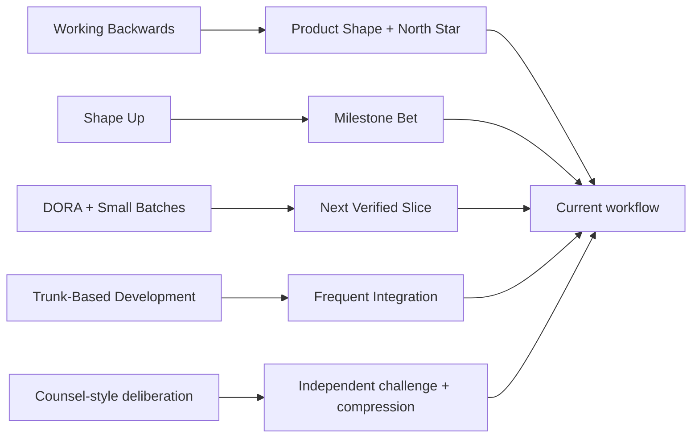
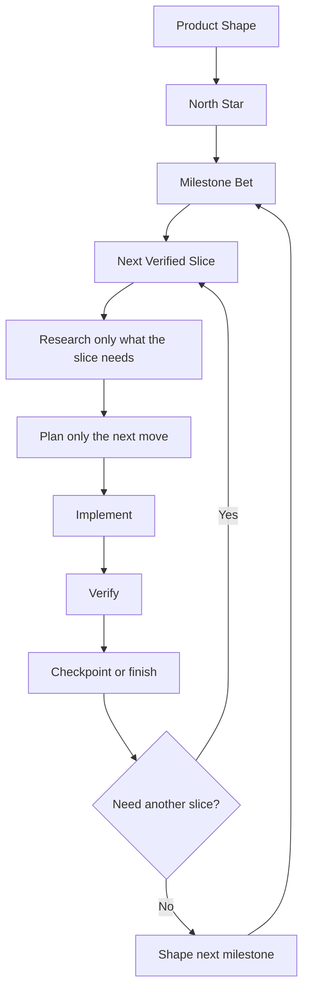

# Fast Stable Delivery

This document captures the external execution systems that most strongly match this workspace's goal:

**move fast, stay stable, and keep motivation high on large goals**

The synthesis is:

## What the Strongest Systems Agree On

### 1. Start with a written outcome, not implementation detail

Amazon's Working Backwards process starts by defining the customer experience first, then iterating backward until the team has clarity on what to build. In practice, that means a clear target state should exist before the build plan gets detailed.

In this workspace, that maps to:

- `Product Shape`
- `North Star`
- `grill`
- milestone shaping before implementation

The product-shaping layer exists because moving fast depends on compressing complicated intent. If the desired experience cannot be explained simply, the next slice is likely to solve the wrong thing.

### 2. Bet one bounded cycle at a time

Shape Up's central idea is not to fully plan the whole future. It is to shape the work, place a bounded bet, and build inside that appetite. For new products, Shape Up explicitly distinguishes R&D mode from production mode and says teams should still bet only one cycle at a time.

In this workspace, that maps to:

- `Milestone Bet`
- `slice-first`
- anti-paralysis planning guard

### 3. Small batches improve both speed and stability

DORA explicitly says speed and stability are not tradeoffs for most teams. It also says a common way to improve both is to reduce the batch size of changes. Small batches make feedback faster, failures easier to recover from, and learning cheaper.

In this workspace, that maps to:

- `Next Executable Slice`
- `checkpoint`
- `finish-task`
- small verified phases instead of giant speculative plans

### 4. Integrate frequently and avoid long-lived divergence

Trunk-Based Development emphasizes frequent integration, short-lived branches, and keeping the codebase releasable. The point is to avoid merge hell, reduce hidden drift, and get feedback sooner.

In this workspace, that maps to:

- current-checkout by default for small coherent work
- isolated worktree only when risk or scope justifies it
- checkpoint commits after verified phases
- short-lived branches instead of long-running divergence

## The Composite Model

The best match for this workspace is not one named framework. It is a layered system:

This gives the workspace four planning levels:

- `Product Shape`: compress the desired final experience into a simple artifact
- `North Star`: preserve the big why and success criteria
- `Milestone Bet`: define one bounded meaningful advance
- `Next Verified Slice`: define the next fast executable unit

## Counsel Placement

Counsel-style review is useful when judgment diversity beats raw execution speed.

Use it for:

- product shaping
- milestone selection
- architecture review
- optimization review
- high-cost tradeoff decisions

Avoid it for ordinary implementation. The output of counsel should be one compressed recommendation, not a larger pile of opinions.

## How to Measure Whether the Workflow Is Healthy

Borrowing from DORA, the question is not just "are we busy?" It is:

- how quickly can a change move from decision to verified result
- how often can we complete a verified slice
- how easy is recovery when a slice goes wrong
- how often do we have to rework because the batch was too large

For this workspace, the practical proxies are:

- planning rounds before execution
- slice size
- checkpoint frequency
- rate of wrong-lane corrections
- amount of dirty unverified work carried across phases

## What This Means Operationally

When a task begins:

- compress the intended product experience when the goal is broad or emotional
- preserve the large goal separately if it is long-horizon
- shape only one bounded milestone
- detail only the next slice

When a task is underway:

- keep slices small enough to verify quickly
- integrate and checkpoint often
- restart the session when the phase changes or quality drops

When a task drifts:

- go back one phase instead of forcing forward
- reduce slice size before increasing planning complexity

When optimization comes up:

- optimize only with evidence, unless the architecture risk is both obvious and expensive to reverse

## Alignment Check

Current workflow alignment is strong:

- Working Backwards: present through `Product Shape` and `North Star`
- Shape Up: present through `Milestone Bet` and appetite-bounded shaping
- DORA small-batch stability: present through `slice-first`, anti-paralysis, checkpointing, and verified phases
- Trunk-Based Development: present through short-lived worktree usage, current-checkout default, and frequent verified integration
- Counsel-style deliberation: present as an optional gate for shaping and high-cost decisions

The main rule to preserve is:

> Think big, bet medium, execute tiny.
