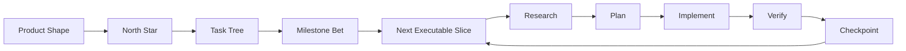
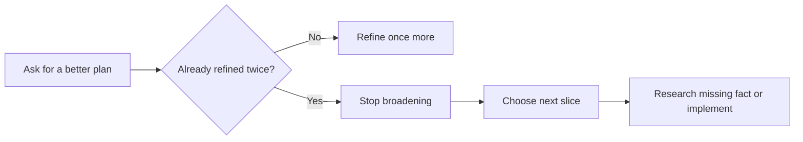
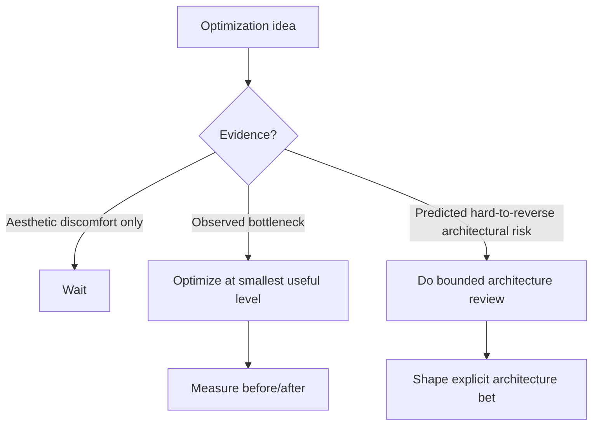

# Phase-Based Agent Workflow

This workspace uses one default execution shape for non-trivial tasks:

**Think big -> bet medium -> execute tiny**

Default entrypoint:

- start with `/grill your task` when the request is broad, underspecified, or high-cost to misunderstand
- start with `/start-task your task`
- use `/shape-product your goal` when the final experience needs to be grilled and compressed before planning
- use `/counsel your decision` when a product, milestone, or architecture decision needs independent challenge
- use `/task-tree your goal` when a large goal needs a coarse workstream map before choosing the first milestone
- start with `/north-star your goal` when the task is a long-horizon dream or preservation target
- start with `/shape-milestone your goal` when the big goal is known but the next meaningful bet is not
- start with `/slice-task your task` when the task is obviously too large for one fast cycle
- use direct handling only when the task is truly small and obvious

This execution shape is intentionally aligned with a composite of:

- Amazon Working Backwards for outcome-first framing
- Shape Up for bounded milestone bets
- DORA for small-batch speed plus stability
- Trunk-Based Development for frequent integration and short-lived divergence

## Iteration Strategy

The default strategy is fast iteration with feedback, not giant one-shot execution.

For oversized tasks:

- build a coarse milestone ladder
- detail only the next executable slice
- verify that slice
- checkpoint
- repeat

Do not try to fully finish a broad system in one plan or one session by default.

This is not just preference. It follows the DORA finding that smaller changes improve both throughput and stability, and the Shape Up practice of betting one bounded cycle at a time.

## Planning Levels

There are five planning levels, and they should not be mixed.

```mermaid
flowchart TD
    P["Product Shape"] --> P1["One-sentence product promise"]
    P --> P2["Fidelity anchors"]
    P --> P3["Edge cases and simplifications"]

    A["North Star"] --> A1["Why this large goal matters"]
    A --> A2["What must feel faithful or true"]
    A --> A3["What success would prove"]

    T["Task Tree"] --> T1["Major domains"]
    T --> T2["Milestone candidates"]
    T --> T3["Dependency order"]

    B["Milestone Bet"] --> B1["One meaningful bounded capability"]
    B --> B2["1-3 slice appetite"]
    B --> B3["What is explicitly not now"]

    C["Next Slice"] --> C1["3-5 concrete steps"]
    C --> C2["One verification target"]
    C --> C3["One checkpoint boundary"]
```

Product Shape should make the end state simple. North Star should stay large. Task Tree should stay coarse. Milestone should stay bounded. Slice should stay concrete.

This matches three different external needs:

- Working Backwards: preserve the intended experience
- Shape Up: define one bounded bet
- DORA and trunk-based development: keep execution batches small enough to integrate and verify quickly

## Product Shaping Rule

For long-horizon product goals, first compress the intended experience before choosing the milestone.

Use `/shape-product` when the user can describe the dream, but the system still needs to extract:

- the one-sentence product promise
- the fidelity anchors that must feel right
- the edge cases that would make the result feel false
- the simplifications allowed in the first milestone
- the smallest proof that would make the direction real

This is the Working Backwards layer: understand the final experience clearly enough that the next bet can stay small.

## Counsel Rule

Use `/counsel` only where independent perspectives improve judgment:

- product shaping
- milestone choice
- architecture review
- optimization review
- high-cost tradeoff decisions

Do not use counsel for ordinary implementation by default. Implementation should stay narrow, verified, and mostly single-threaded unless the work is already split into separate bounded worktree tasks.

## Task Tree Rule

Use `/task-tree` when a large goal has multiple domains that should not be forgotten.

For example, a Roblox-style game recreation might split into:

- product experience
- game design
- player controller
- 3D world
- combat system
- client-server
- content pipeline
- feedback polish

The tree prevents blind spots. It should not turn into a full project plan. Keep the domain tree coarse, choose one milestone, and detail only the first slice.

## Phase 1: Research

Goal: understand the system before changing it.

During research:

- read the startup files first
- prefer `/research your task` when command shortcuts are available
- use `bash ./scripts/retrieve-context.sh "query"` to pull only relevant local context
- identify exact files, dependencies, and edge cases
- do not implement yet

Expected output:

- the exact files involved
- the important lines or functions
- the data flow or dependency flow
- the main risks and edge cases

## Phase 2: Plan

Goal: turn research into explicit steps.

During planning:

- prefer `/plan your task` when command shortcuts are available
- for large tasks, prefer milestone ladder plus first-slice planning instead of full end-to-end detail
- define the exact files that will change
- define the tests or verification for each step
- define what should not change
- define rollback or recovery points when relevant

Expected output:

- a step-by-step plan
- verification commands
- clear scope boundaries

## Anti-Paralysis Rule

Planning should not loop forever.

If the same task has already gone through two planning refinements:

- stop broadening the plan
- choose the next verified slice
- move back toward `/research` for the missing fact or `/implement` for the ready slice

The plan only needs to be good enough for the next fast cycle, not perfect for the whole project.

## Phase 3: Implement

Goal: execute the plan in small verified slices.

During implementation:

- prefer `/implement your task` when command shortcuts are available
- run `bash ./scripts/phase-gate.sh implement ...` or let `/implement` enforce the same gate
- follow the plan instead of improvising broadly
- keep the active context narrow
- review each change before moving on
- commit after verified phases

Expected behavior:

- small reversible edits
- frequent checkpointing
- new session when the phase changes or context quality drops

## Task Intake Rule

Use a compact intake before non-trivial work:

- what is the goal
- what is in scope
- what kind of change is this
- what proves success
- what lane should this start in

Use direct handling only when all of these are true:

- the request is clear
- the scope is small
- the files are obvious
- verification is simple
- the task does not need a deeper system read first

Otherwise, start in research.

For serious tasks, treat `/start-task` as the implicit default even if the user does not explicitly ask for task shaping first.

The user should be able to type normal language. The agent should run the workflow machinery, report the current lane, and give one next action. Slash commands are operator shortcuts, not a memory burden for the user.

For long-horizon goals, `/start-task` should route toward `north-star` and `shape-milestone` before normal slice planning.

## Grill Rule

Use `/grill` before research when:

- the request has multiple possible interpretations
- wrong assumptions would create a lot of wasted code
- the task is expensive, architectural, or upstream-facing

The goal is to sharpen scope, expose hidden assumptions, and reduce waste before deeper execution starts.

## Phase Gate Rule

Implementation should stop and refuse to proceed when:

- the key files are still unclear
- verification is still unclear
- the scope is still mixed or changing
- the plan is still missing
- contribution guidance has not been read for upstream-facing work

When blocked, go back exactly one phase instead of improvising forward.

## Session Boundary Rule

One task per session is the default.

Use `bash ./scripts/session-boundary.sh` to decide when to:

- or use `/session-boundary` for the shortcut form

- continue
- checkpoint now
- checkpoint and restart in a new session

Restart when:

- the phase changes
- the topic shifts
- quality drops
- the thread gets long
- context meter is clearly too full

Do not keep trying to rescue a degraded thread if a fresh one would be cleaner.

## Handoff Rule

Use `/handoff` before starting a new session when the work is not finished.

The packet should preserve:

- goal
- current phase
- verified so far
- key decisions
- open risks
- exact files
- next command

The packet should drop debate, stale alternatives, and solved branches. It exists to make the next session start cleanly, not to preserve the whole conversation.

## Checkpoint Rule

After a verified phase:

- update `session-state.json`
- use `/checkpoint` when you want a compact wrap-up
- prefer a checkpoint commit before a risky next phase

## Optimization Lane

Optimization is a separate lane, not casual cleanup.

Use `/optimize` when the task is really about performance, efficiency, or architecture cost.

## Delivery Health Rule

The aim is not raw activity. The aim is fast verified progress without accumulating instability.

Use these practical signals:

- how quickly a slice moves from decision to verification
- how often verified slices complete
- how often a slice forces rework
- how much dirty unverified work survives across checkpoints

If these worsen, reduce slice size before adding more planning complexity.
