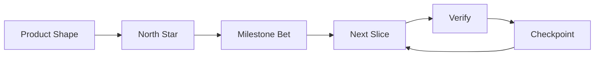

# agentic-workflows Workspace System Overview

This workspace is the control hub for the parent folder that contains `agentic-workflows`. It is a living knowledge base for prompt design, agent workflows, and cross-repo lesson propagation. Not a code project.

**Current environment:** Debian/WSL2. All scripts use bash/Linux tooling.

Shortest version:

> This hub learns useful patterns, stores them in central docs, and pushes reusable parts out to sibling topic folders while protecting your custom content.

## 30-Second Read

| Subsystem | What it does | Main locations |
|---|---|---|
| Central knowledge | Stable guidance and research synthesis | `docs/`, `research/`, `archive/` |
| Distribution | Copies reusable rules outward | `propagation/`, `scripts/propagate-to-all.sh` |
| Live workflow state | Tracks current work, sync state, harvested lessons | `workflow/` |

Most work follows: **research → integrate → propagate → verify → document**

On every resume, read `session-state.json` first. Then `AGENTS.md`.

## Fast Startup

| Step | Read | Why |
|---|---|---|---|
| 1 | `session-state.json` | Current task, last work, next action |
| 2 | `AGENTS.md` | Operating contract |
| 3 | `docs/workflow.md` | Fast orientation |
| 4 | Task-specific files | Deep docs, topic folders, scripts |

For topic-folder work: `[Topic]/session-state.json` → `[Topic]/AGENTS.md` → `[Topic]/docs/workflow.md` → local `meta/` only when deeper context is needed.

## Hub vs Topic Folders

| Area | What it is | Where work goes |
|---|---|---|
| agentic-workflows hub | Central knowledge and propagation system | `docs/`, `research/`, `scripts/`, `workflow/`, `propagation/`, `archive/`, `personal-voice/` |
| Sibling topic folders | Individual project/topic workspaces | `[topic-name]-content/` |

Do not create `agentic-workflows-content/` in this hub unless the whole hub is intentionally redesigned. Content folders use kebab-case: e.g. `fluent-prs-content`.

Fast iteration rules: broad tasks become milestone ladder + first slice. Stop planning after two refinements. One verified slice beats one giant plan. Optimize by evidence.

Big-goal workflow:



Influences: Amazon Working Backwards (outcome before detail), Shape Up (one milestone at a time), DORA (small batches), Trunk-Based Development (frequent integration).

## Expected Topic-Folder Root

```
[Topic-Folder]/
|- AGENTS.md                         (hub-owned managed core)
|- .ai-prompting-hub.sh              (hub-owned managed core)
|- docs/workspace-system-overview.md (hub-owned managed core)
|- git-github-best-practices.md      (hub-owned managed core)
|- quality-standards.md              (hub-owned managed core)
|- scripts/*.sh                      (hub-owned managed core)
|- commands/                        (hub-owned managed core; single source — synced via sync-commands.sh)
|- session-state.json                (repo-owned)
|- topic-insights.md                 (repo-owned)
|- .cleanup-protect                  (repo-owned)
|- archive/history-*                 (repo-owned)
|- [topic-name]-content/             (YOUR WORK — created by propagation)
`- meta/                             (NEVER touched by propagation)
```

For the full propagation ownership split, see `scripts/propagation-contract.sh`.

## Top-Level Folder Map

| Path | Role |
|---|---|
| `docs/` | Main knowledge base |
| `research/` | Active research intake and distilled findings |
| `propagation/` | Source templates for topic folders |
| `scripts/` | Automation |
| `workflow/` | Stateful files: sync state, registries, harvested lessons |
| `archive/` | Preserved historical material |
| `personal-voice/` | User voice profile, samples, correction log |

Root files: `AGENTS.md` (operating contract, read after session-state) and `README.md` (navigation index).

## Terminal Strategy

Primary terminal is Debian/WSL2. All hub scripts use bash/Linux tooling. See `docs/repo-tooling.md` for the full baseline.

## Governance

- Global runtime authority: `/home/namikaz/.config/opencode/opencode.jsonc`
- Per-repo authority: `session-state.json` → `AGENTS.md` → this doc
- No repo-local OpenCode config files (except `.opencode/commands/`)
- After model, tool, or OS changes, scan for stale assumptions before resuming work

## Main Operating Loop

### 1. Research

Active research in `research/research-log.md`. Completed campaigns move to `archive/`. Durable findings go into the smallest correct central doc.

### 2. Integrate

Rewrite useful findings into the right central doc:
- Context/cost → `docs/token-efficient-prompting.md`
- Product/agent architecture → `docs/ai-product-building.md`
- Workflow doctrine → `docs/core-agent-doctrine.md`
- Model routing → `docs/model-selection-guide.md`
- Cross-project flow → `docs/cross-project-memory-loop.md`

### 3. Propagate

Propagation bootstraps missing shared files into topic folders and refreshes hub-owned managed core. It never overwrites repo-owned files (session-state, topic-insights, archive history).

```bash
bash scripts/propagate-to-all.sh      # preview
bash scripts/propagate-to-all.sh --apply  # apply
```

Managed core templates live in `propagation/`. Run `cat scripts/propagation-contract.sh | grep '".*:.*"'` for the full mapping.

### 4. Verify

```bash
bash scripts/ws.sh validate   # file budgets and hot-path health
bash scripts/ws.sh status     # workspace overview
bash scripts/ws.sh hotspots   # size trends
```

Topic folders: run `./audit-folder-quality.sh`.

### 5. Document

Update `session-state.json` at the end of meaningful work. Link deep detail instead of bloating hot-path files.

## Source vs Generated

Edit directly: `AGENTS.md`, `README.md`, `docs/*.md`, `research/*.md`, `propagation/*`, `session-state.json`, `workflow/cross-domain-registry.md`

Generated or refreshed by scripts: `workflow/harvested-topic-insights.md`, `workflow/cross-domain-candidates.md`, `workflow/sync-state.json`

Generated files can be large and should not be part of the default cold-start path.

## What This Optimizes For

The system makes work compound: learn from the task, save the lesson, generalize when useful, push to other folders, reduce future rework.

**Core principle:** Prefer simple code. Add complexity only when a concrete system interaction demands it. Premature abstraction is as harmful as premature optimization. If you can't explain why a pattern is needed, it probably isn't.

## Scripts

See `scripts/` for automation and `commands/` for slash commands. For a detailed catalog, run `ls scripts/` or `ls commands/`.
