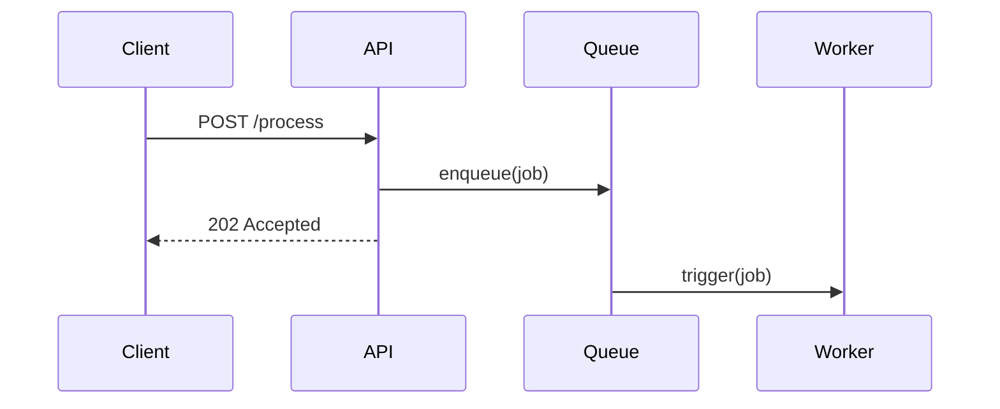

<!-- Managed-By: AI-Prompting-Library -->
<!-- Template: Git-GitHub-Best-Practices -->
# Git & GitHub Best Practices

Principles for humans and AI agents to work effectively with Git and GitHub.

## Why This Matters for AI Agents

AI agents that don't understand repository state cause downstream problems:
- Working on stale branches causes merge conflicts
- Not checking remote changes leads to lost work
- Pushing without resolving conflicts pollutes history

These problems compound when multiple agents or humans work together.

---

## State Awareness

### Always Fetch Before Starting Work

Before making any changes:
1. Fetch the latest from remote to see what changed
2. Check your current branch against the remote
3. Understand if new commits exist that may affect your work

For AI agents: confirm the repo state is current before editing.

[AI agents should fetch before editing: enable/disable]

### Understand Remote Before Committing

Before committing:
1. Check `git status` to see current state
2. Review `git log` or diff to understand recent changes
3. Identify if rebasing or merging is needed

[Require pre-commit remote check: yes/no]

### Resolve Conflicts Before Pushing

Never push with unresolved conflicts. Either:
- Resolve them locally and complete the merge/rebase
- Leave the work uncommitted until resolved

[Allow pushing with conflicts: yes/no]

---

## Commit Discipline

### Write Meaningful Messages

Good commit messages explain:
- **What** changed
- **Why** it changed (the context)
- **How** it addresses the issue

Bad messages: "fix", "update", "changes", "wip"

[Commit message format: freeform/imperative/conventional]

### Keep Commits Atomic

Each commit should represent one logical change:
- Don't mix refactoring with bug fixes
- Don't combine multiple features
- Keep it small enough to describe in one sentence

[Max lines per commit: number or leave blank]

### Use Imperative Mood

```
✓ Add user authentication
✓ Fix login redirect loop
✗ Added user authentication
✗ Fixed the login bug
```

---

## Branch Strategy

### Prefer Trunk-Based Development

Work directly on the main branch or use short-lived feature branches:
- Main branch stays deployable
- Feature branches live for hours or days, never weeks

[Primary workflow: trunk-based/feature-branches/gitflow]

### Use Clear Branch Names

Names should describe the work:
- `feature/user-authentication`
- `fix/login-redirect-loop`
- `docs/readme-update`

Avoid: `work`, `tmp`, `fix1`, `branch`

[Branch naming convention: prefix/description]

[List common prefixes to use: feature/, fix/, docs/, refactor/, test/]

### Delete Branches After Merge

Remove merged branches to keep the repo clean:
```bash
git branch -d branch-name
```

[Auto-delete merged branches: yes/no]

[Default branch name: main/master]

---

## Pull Request Craft

### Keep PRs Small and Focused

A good PR:
- Addresses one concern
- Fits in a few hundred lines of diff
- Can be reviewed in 10-15 minutes

[Max files per PR: number or leave blank]
[Max lines per PR: number or leave blank]

### Write Descriptive PR Bodies

Include:
- What the change does
- Why it's needed
- Links to related issues
- Any testing done

[Require linked issues: yes/no]

### Use Sequence Diagrams for Behavioral PRs

Sequence diagrams in PRs are high-signal for behavioral changes, noise for trivial ones.

**Add a diagram when:**
- Explaining async/multi-step workflows (API flows, event-driven architecture)
- Showing multi-service interactions or state machine changes
- The behavioral change is harder to explain in text than in visual form

**Skip the diagram when:**
- Pure refactors, data-only changes, simple CRUD, one-line fixes

**Tool:** Mermaid (renders natively in GitHub):

```markdown

```

**Rule of thumb:** Add a diagram when explaining the *behavior* takes more text than drawing the *interaction*.

[Use sequence diagrams in PRs: yes/no]

### Respond to Reviews Promptly

- Address feedback directly
- Don't take criticism personally
- Ask for clarification when needed

[Require review before merge: yes/no]

[Required approvals: number]

[Allow force pushes to protected branches: yes/no]

---

## AI Agent Collaboration

### Rules for AI Agents

1. **Never auto-commit without approval** - show diffs first
2. **Always fetch before starting work** - confirm state is current
3. **Reference task context** - include issue/reason in commits
4. **Defer to human judgment** - especially on merge decisions
5. **Show meaningful diffs** - not whitespace-only changes

[AI agents may auto-commit: yes/no]
[AI agents may push directly: yes/no]

### When Working With Others

- Check for recent commits from others before making changes
- Communicate what you're working on to avoid collisions
- Don't assume you're the only one modifying the repo

[Announce work in progress: yes/no]

---

## Repo Hygiene

### Maintain Thorough .gitignore

Keep the repo clean by ignoring:
- Build artifacts (`node_modules/`, `dist/`, `target/`)
- IDE files (`.vscode/`, `.idea/`)
- OS files (`.DS_Store`, `Thumbs.db`)
- Secrets and credentials (`*.env`, `secrets.json`)

[Add custom .gitignore entries here]

### Avoid Committing Large Files

- Use Git LFS for binary assets
- Don't commit dependencies (use package managers)
- Keep the repo clone fast

[Use Git LFS for: blank or list patterns]

### Never Commit Secrets

- Credentials belong in environment variables
- Use `.gitignore` to exclude config files with secrets
- Rotate exposed secrets immediately

[Secrets storage: env-variables/secret-manager/other]

---

## GitHub Features

### Branch Protection

Protect main branches by:
- Requiring review before merge
- Blocking force pushes
- Running CI checks

[Protected branches: list or main/master]

### Use GitHub Actions Wisely

- Keep workflows simple and fast
- Fail fast on important checks
- Cache dependencies when possible

[List CI workflows here]

### Use Copilot Instructions

Add repo-specific guidance in `.github/copilot-instructions.md` for code review and completion.

[Copilot instructions file: exists/does-not-exist]

---

## Summary

1. **Always know the current state** - fetch before working
2. **Commit meaningfully** - explain why, not just what
3. **Keep branches short-lived** - merge quickly, delete after
4. **Resolve conflicts fully** - never push broken state
5. **For AI agents** - confirm state, show diffs, defer to humans

## Custom Section

<!-- Custom-Section: Git-GitHub -->
Add repo-specific Git/GitHub rules here.

<!-- End-Custom-Section -->